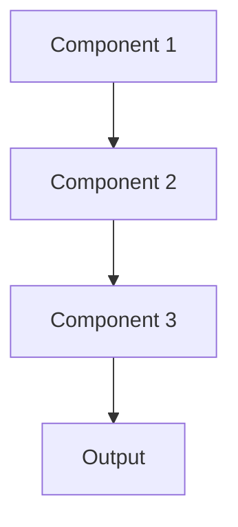

# Batch prediction Pattern

## Overview

Batch Inference processes large volumes of data offline in scheduled batches rather than real-time requests. For healthcare summarization, this might mean nightly processing of all new patient admissions or monthly summarization of clinical trial data, optimizing for throughput over latency.

## When to Use

- **Large-scale processing**: Thousands of documents to process regularly
- **Non-urgent timelines**: Results needed within hours/days, not seconds
- **Cost optimization**: Batch processing often cheaper than real-time serving
- **Resource efficiency**: Can use spot instances or off-peak compute
- **Scheduled workflows**: Regular processing schedules (nightly, weekly)

## When Not to Use

- **Real-time requirements**: Users need immediate results
- **Interactive applications**: Results displayed to users waiting
- **Unpredictable timing**: Requests arrive randomly rather than in batches
- **Low volume**: Too few requests to justify batch infrastructure
- **Streaming data**: Continuous data flow better suited to stream processing

## Architecture



## Implementation Examples

### Vertex AI (Google Cloud) Implementation

```python
# Implementation example using Vertex AI
```

### LangChain Implementation

```python
# Implementation example using LangChain
```

### Anthropic (Claude) Implementation

```python
# Implementation example using Anthropic
```

### Ollama Implementation

```python
# Implementation example using Ollama
```

## Performance Characteristics

### Latency
- [Latency characteristics]

### Throughput
- [Throughput characteristics]

### Resource Usage
- [Resource usage characteristics]

## Trade-offs

### Advantages
- [Advantage 1]
- [Advantage 2]

### Disadvantages
- [Disadvantage 1]
- [Disadvantage 2]

## Use Cases

### Healthcare Summarization
- [Healthcare use case 1]
- [Healthcare use case 2]

### General Use Cases
- [General use case 1]
- [General use case 2]

## Well-Architected Framework Alignment

### Operational Excellence
- [Operational excellence considerations]

### Security
- [Security considerations]

### Reliability
- [Reliability considerations]

### Cost Optimization
- [Cost optimization considerations]

### Performance
- [Performance considerations]

### Sustainability
- [Sustainability considerations]

## Deployment Considerations

### Zonal Deployment
- [Zonal deployment considerations]

### Regional Deployment
- [Regional deployment considerations]

### Multi-Regional Deployment
- [Multi-regional deployment considerations]

### Hybrid Deployment
- [Hybrid deployment considerations]

## Related Patterns
- [Related Pattern 1](./related-pattern-1.md)
- [Related Pattern 2](./related-pattern-2.md)

## References
- [Reference 1]
- [Reference 2]

## Version History
- **v1.0** (YYYY-MM-DD): Initial version

