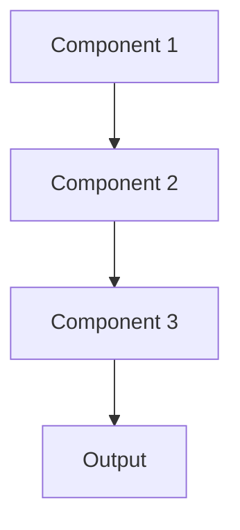

# Canary deployment Pattern

## Overview

Canary Deployment gradually rolls out new model versions to increasing percentages of traffic, monitoring for issues at each stage before full deployment. Named after canaries in coal mines, this pattern detects problems early with minimal impact, crucial for safety-critical healthcare applications.

## When to Use

- **High-risk changes**: Major model architecture or training data changes
- **Large user base**: Issues affect many users; gradual rollout reduces blast radius
- **Monitoring infrastructure**: Can detect degradation quickly
- **Rollback capability**: Can revert to previous version if canary fails
- **Production validation**: Need to verify model behavior in real clinical workflows

## When Not to Use

- **Low-risk updates**: Minor improvements with high confidence
- **Small user base**: All users are canaries anyway
- **No monitoring**: Can't detect if canary is failing
- **Instant rollout needed**: Critical fix required immediately
- **Consistent traffic**: Not enough traffic variation to test at different scales

## Architecture



## Implementation Examples

### Vertex AI (Google Cloud) Implementation

```python
# Implementation example using Vertex AI
```

### LangChain Implementation

```python
# Implementation example using LangChain
```

### Anthropic (Claude) Implementation

```python
# Implementation example using Anthropic
```

### Ollama Implementation

```python
# Implementation example using Ollama
```

## Performance Characteristics

### Latency
- [Latency characteristics]

### Throughput
- [Throughput characteristics]

### Resource Usage
- [Resource usage characteristics]

## Trade-offs

### Advantages
- [Advantage 1]
- [Advantage 2]

### Disadvantages
- [Disadvantage 1]
- [Disadvantage 2]

## Use Cases

### Healthcare Summarization
- [Healthcare use case 1]
- [Healthcare use case 2]

### General Use Cases
- [General use case 1]
- [General use case 2]

## Well-Architected Framework Alignment

### Operational Excellence
- [Operational excellence considerations]

### Security
- [Security considerations]

### Reliability
- [Reliability considerations]

### Cost Optimization
- [Cost optimization considerations]

### Performance
- [Performance considerations]

### Sustainability
- [Sustainability considerations]

## Deployment Considerations

### Zonal Deployment
- [Zonal deployment considerations]

### Regional Deployment
- [Regional deployment considerations]

### Multi-Regional Deployment
- [Multi-regional deployment considerations]

### Hybrid Deployment
- [Hybrid deployment considerations]

## Related Patterns
- [Related Pattern 1](./related-pattern-1.md)
- [Related Pattern 2](./related-pattern-2.md)

## References
- [Reference 1]
- [Reference 2]

## Version History
- **v1.0** (YYYY-MM-DD): Initial version

