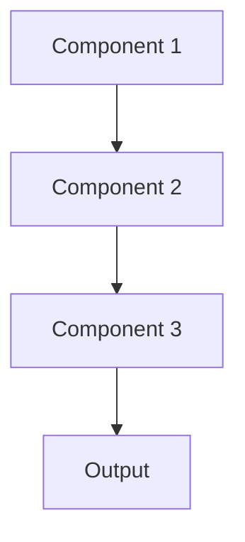

# Edge deployment Pattern

## Overview

Edge Deployment runs models on local devices (phones, tablets, medical devices) rather than cloud servers, enabling offline operation, reducing latency, and keeping sensitive data on-device. For healthcare, this allows clinical summaries on tablets in areas with poor connectivity or ultra-private processing of patient data.

## When to Use

- **Offline requirements**: Must work without internet connectivity
- **Ultra-low latency**: Network round-trip unacceptable
- **Privacy constraints**: Data cannot leave device due to regulations
- **Edge devices available**: Target devices have sufficient compute (modern tablets, workstations)
- **Network costs**: Reducing cloud API calls saves significant money

## When Not to Use

- **Large models**: Model too big for edge device memory/compute
- **Frequent updates**: Model changes too often to push to all devices
- **Heterogeneous devices**: Too many different device types to support
- **Cloud advantages**: Need massive compute or latest model versions
- **Connected environments**: Reliable high-speed internet always available

## Architecture



## Implementation Examples

### Vertex AI (Google Cloud) Implementation

```python
# Implementation example using Vertex AI
```

### LangChain Implementation

```python
# Implementation example using LangChain
```

### Anthropic (Claude) Implementation

```python
# Implementation example using Anthropic
```

### Ollama Implementation

```python
# Implementation example using Ollama
```

## Performance Characteristics

### Latency
- [Latency characteristics]

### Throughput
- [Throughput characteristics]

### Resource Usage
- [Resource usage characteristics]

## Trade-offs

### Advantages
- [Advantage 1]
- [Advantage 2]

### Disadvantages
- [Disadvantage 1]
- [Disadvantage 2]

## Use Cases

### Healthcare Summarization
- [Healthcare use case 1]
- [Healthcare use case 2]

### General Use Cases
- [General use case 1]
- [General use case 2]

## Well-Architected Framework Alignment

### Operational Excellence
- [Operational excellence considerations]

### Security
- [Security considerations]

### Reliability
- [Reliability considerations]

### Cost Optimization
- [Cost optimization considerations]

### Performance
- [Performance considerations]

### Sustainability
- [Sustainability considerations]

## Deployment Considerations

### Zonal Deployment
- [Zonal deployment considerations]

### Regional Deployment
- [Regional deployment considerations]

### Multi-Regional Deployment
- [Multi-regional deployment considerations]

### Hybrid Deployment
- [Hybrid deployment considerations]

## Related Patterns
- [Related Pattern 1](./related-pattern-1.md)
- [Related Pattern 2](./related-pattern-2.md)

## References
- [Reference 1]
- [Reference 2]

## Version History
- **v1.0** (YYYY-MM-DD): Initial version

