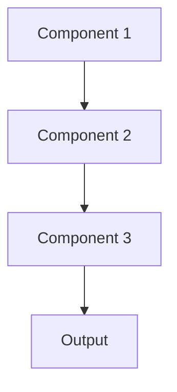

# Model versioning Pattern

## Overview

Model Versioning tracks and manages different versions of ML models throughout their lifecycle, enabling reproducibility, rollbacks, and A/B testing. In healthcare AI, this ensures audit trails for regulatory compliance and allows safe deployment of improved summarization models while maintaining ability to revert if issues arise.

## When to Use

- **Regulatory compliance**: Healthcare regulations require model versioning audit trails
- **Multiple environments**: Different model versions in dev, staging, production
- **Gradual rollouts**: Deploy new versions to subset of users first
- **Reproducibility**: Need to reproduce historical predictions exactly
- **Rollback capability**: Must revert to previous version if problems detected

## When Not to Use

- **Single version**: Only ever one model version in production
- **Disposable models**: Models replaced completely rather than versioned
- **No compliance needs**: No regulatory or audit requirements
- **Experimental phase**: Still in research; versioning overhead premature
- **Simple updates**: Model changes don't affect predictions significantly

## Architecture



## Implementation Examples

### Vertex AI (Google Cloud) Implementation

```python
# Implementation example using Vertex AI
```

### LangChain Implementation

```python
# Implementation example using LangChain
```

### Anthropic (Claude) Implementation

```python
# Implementation example using Anthropic
```

### Ollama Implementation

```python
# Implementation example using Ollama
```

## Performance Characteristics

### Latency
- [Latency characteristics]

### Throughput
- [Throughput characteristics]

### Resource Usage
- [Resource usage characteristics]

## Trade-offs

### Advantages
- [Advantage 1]
- [Advantage 2]

### Disadvantages
- [Disadvantage 1]
- [Disadvantage 2]

## Use Cases

### Healthcare Summarization
- [Healthcare use case 1]
- [Healthcare use case 2]

### General Use Cases
- [General use case 1]
- [General use case 2]

## Well-Architected Framework Alignment

### Operational Excellence
- [Operational excellence considerations]

### Security
- [Security considerations]

### Reliability
- [Reliability considerations]

### Cost Optimization
- [Cost optimization considerations]

### Performance
- [Performance considerations]

### Sustainability
- [Sustainability considerations]

## Deployment Considerations

### Zonal Deployment
- [Zonal deployment considerations]

### Regional Deployment
- [Regional deployment considerations]

### Multi-Regional Deployment
- [Multi-regional deployment considerations]

### Hybrid Deployment
- [Hybrid deployment considerations]

## Related Patterns
- [Related Pattern 1](./related-pattern-1.md)
- [Related Pattern 2](./related-pattern-2.md)

## References
- [Reference 1]
- [Reference 2]

## Version History
- **v1.0** (YYYY-MM-DD): Initial version

