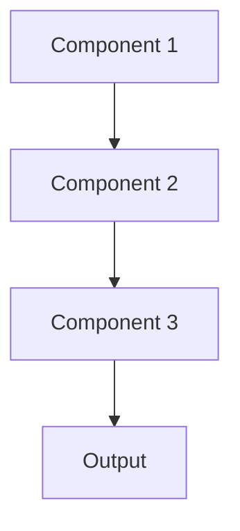

# Real time prediction Pattern

## Overview

Real-Time Inference delivers predictions with minimal latency, typically under 100ms-1s, enabling interactive user experiences. In healthcare, this supports applications like live clinical note summarization as physicians document, or instant patient history summaries during emergency admissions.

## When to Use

- **Interactive UIs**: Users expect immediate feedback (<1s response)
- **Clinical workflows**: Physicians need results during patient encounters
- **Emergency scenarios**: Time-critical medical decisions require fast summaries
- **User experience**: Latency directly impacts application usability
- **Synchronous operations**: Downstream processes wait for predictions

## When Not to Use

- **Batch suitable**: Predictions can wait hours/days
- **High cost sensitivity**: Real-time infrastructure more expensive than batch
- **Complex models**: Model too large/slow for real-time constraints
- **Low QPS**: Request volume doesn't justify always-on infrastructure
- **Acceptable delays**: Users tolerate 5-30 second waits

## Architecture



## Implementation Examples

### Vertex AI (Google Cloud) Implementation

```python
# Implementation example using Vertex AI
```

### LangChain Implementation

```python
# Implementation example using LangChain
```

### Anthropic (Claude) Implementation

```python
# Implementation example using Anthropic
```

### Ollama Implementation

```python
# Implementation example using Ollama
```

## Performance Characteristics

### Latency
- [Latency characteristics]

### Throughput
- [Throughput characteristics]

### Resource Usage
- [Resource usage characteristics]

## Trade-offs

### Advantages
- [Advantage 1]
- [Advantage 2]

### Disadvantages
- [Disadvantage 1]
- [Disadvantage 2]

## Use Cases

### Healthcare Summarization
- [Healthcare use case 1]
- [Healthcare use case 2]

### General Use Cases
- [General use case 1]
- [General use case 2]

## Well-Architected Framework Alignment

### Operational Excellence
- [Operational excellence considerations]

### Security
- [Security considerations]

### Reliability
- [Reliability considerations]

### Cost Optimization
- [Cost optimization considerations]

### Performance
- [Performance considerations]

### Sustainability
- [Sustainability considerations]

## Deployment Considerations

### Zonal Deployment
- [Zonal deployment considerations]

### Regional Deployment
- [Regional deployment considerations]

### Multi-Regional Deployment
- [Multi-regional deployment considerations]

### Hybrid Deployment
- [Hybrid deployment considerations]

## Related Patterns
- [Related Pattern 1](./related-pattern-1.md)
- [Related Pattern 2](./related-pattern-2.md)

## References
- [Reference 1]
- [Reference 2]

## Version History
- **v1.0** (YYYY-MM-DD): Initial version

