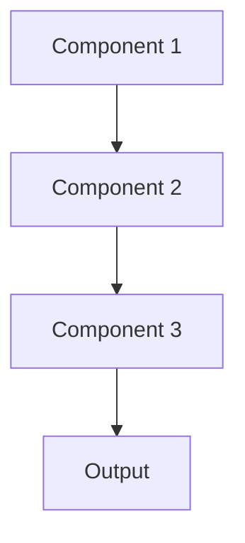

# Attention visualization Pattern

## Overview

Attention Visualization displays which input tokens or regions the model focused on when generating outputs, showing clinicians which parts of patient records influenced summary generation. Particularly valuable for Transformer-based LLMs, providing intuitive visual explanations of model reasoning.

## When to Use

- **Transformer models**: LLMs and other attention-based architectures
- **Text/sequence data**: Explaining which words or sentences influenced output
- **Clinician review**: Helping doctors see what clinical information model emphasized
- **Quality assurance**: Verifying model attends to relevant information
- **Model debugging**: Understanding attention patterns to identify issues

## When Not to Use

- **Non-attention models**: Models without attention mechanisms
- **Tabular data**: Structured data where attention visualization less intuitive
- **Complex reasoning**: Attention patterns don't always reflect true reasoning
- **Misleading**: Attention weights can be difficult to interpret correctly
- **Alternative explanations better**: SHAP or feature importance more appropriate

## Architecture



## Implementation Examples

### Vertex AI (Google Cloud) Implementation

```python
# Implementation example using Vertex AI
```

### LangChain Implementation

```python
# Implementation example using LangChain
```

### Anthropic (Claude) Implementation

```python
# Implementation example using Anthropic
```

### Ollama Implementation

```python
# Implementation example using Ollama
```

## Performance Characteristics

### Latency
- [Latency characteristics]

### Throughput
- [Throughput characteristics]

### Resource Usage
- [Resource usage characteristics]

## Trade-offs

### Advantages
- [Advantage 1]
- [Advantage 2]

### Disadvantages
- [Disadvantage 1]
- [Disadvantage 2]

## Use Cases

### Healthcare Summarization
- [Healthcare use case 1]
- [Healthcare use case 2]

### General Use Cases
- [General use case 1]
- [General use case 2]

## Well-Architected Framework Alignment

### Operational Excellence
- [Operational excellence considerations]

### Security
- [Security considerations]

### Reliability
- [Reliability considerations]

### Cost Optimization
- [Cost optimization considerations]

### Performance
- [Performance considerations]

### Sustainability
- [Sustainability considerations]

## Deployment Considerations

### Zonal Deployment
- [Zonal deployment considerations]

### Regional Deployment
- [Regional deployment considerations]

### Multi-Regional Deployment
- [Multi-regional deployment considerations]

### Hybrid Deployment
- [Hybrid deployment considerations]

## Related Patterns
- [Related Pattern 1](./related-pattern-1.md)
- [Related Pattern 2](./related-pattern-2.md)

## References
- [Reference 1]
- [Reference 2]

## Version History
- **v1.0** (YYYY-MM-DD): Initial version

