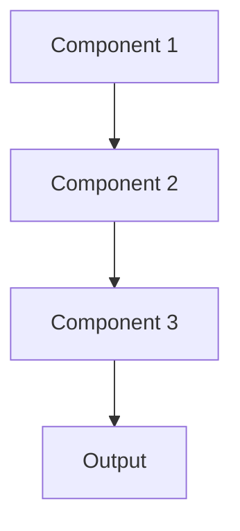

# Counterfactual explanation Pattern

## Overview

Counterfactual Explanations show minimal changes to inputs that would alter model predictions, answering 'what would need to change for a different outcome?'. For healthcare, this might show what lab value changes would result in different risk assessments or what additional symptoms would change diagnostic summaries.

## When to Use

- **Actionable insights**: Helping clinicians understand what interventions might change outcomes
- **Model debugging**: Finding decision boundaries and edge cases
- **Fairness analysis**: Understanding if small changes produce unexpected prediction shifts
- **User understanding**: Counterfactuals often more intuitive than feature importance
- **Clinical scenarios**: Exploring 'what if' questions about patient outcomes

## When Not to Use

- **No causal interpretation**: Changes aren't actually actionable interventions
- **Computational cost**: Generating counterfactuals too expensive
- **Ambiguous changes**: Many possible counterfactuals; unclear which to show
- **Unrealistic scenarios**: Generated counterfactuals clinically implausible
- **Other explanations better**: Feature importance or attention more appropriate

## Architecture



## Implementation Examples

### Vertex AI (Google Cloud) Implementation

```python
# Implementation example using Vertex AI
```

### LangChain Implementation

```python
# Implementation example using LangChain
```

### Anthropic (Claude) Implementation

```python
# Implementation example using Anthropic
```

### Ollama Implementation

```python
# Implementation example using Ollama
```

## Performance Characteristics

### Latency
- [Latency characteristics]

### Throughput
- [Throughput characteristics]

### Resource Usage
- [Resource usage characteristics]

## Trade-offs

### Advantages
- [Advantage 1]
- [Advantage 2]

### Disadvantages
- [Disadvantage 1]
- [Disadvantage 2]

## Use Cases

### Healthcare Summarization
- [Healthcare use case 1]
- [Healthcare use case 2]

### General Use Cases
- [General use case 1]
- [General use case 2]

## Well-Architected Framework Alignment

### Operational Excellence
- [Operational excellence considerations]

### Security
- [Security considerations]

### Reliability
- [Reliability considerations]

### Cost Optimization
- [Cost optimization considerations]

### Performance
- [Performance considerations]

### Sustainability
- [Sustainability considerations]

## Deployment Considerations

### Zonal Deployment
- [Zonal deployment considerations]

### Regional Deployment
- [Regional deployment considerations]

### Multi-Regional Deployment
- [Multi-regional deployment considerations]

### Hybrid Deployment
- [Hybrid deployment considerations]

## Related Patterns
- [Related Pattern 1](./related-pattern-1.md)
- [Related Pattern 2](./related-pattern-2.md)

## References
- [Reference 1]
- [Reference 2]

## Version History
- **v1.0** (YYYY-MM-DD): Initial version

