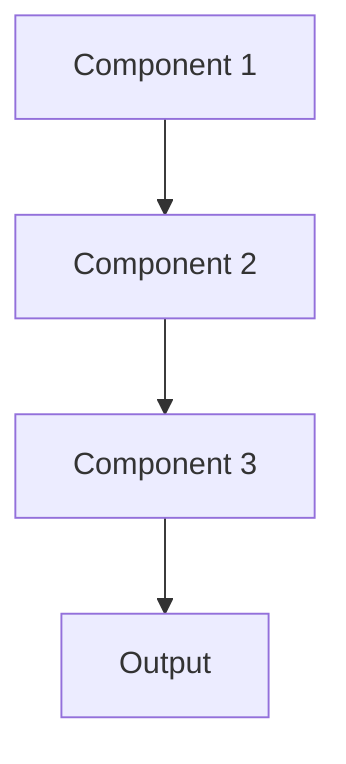

# Feature importance Pattern

## Overview

Feature Importance ranks input features by their contribution to model predictions, showing which clinical variables (lab values, diagnoses, medications) most influence summarization outputs. Helps clinicians understand what drives model behavior and identify if models rely on spurious correlations.

## When to Use

- **Feature selection**: Identifying most relevant clinical variables
- **Model validation**: Ensuring model uses clinically meaningful features
- **Domain understanding**: Learning what factors drive outcomes
- **Debugging**: Identifying if model relies on spurious correlations or data leakage
- **Communication**: Explaining model to non-technical stakeholders

## When Not to Use

- **Unstructured data**: Text or images where 'features' aren't clearly defined
- **Deep learning**: Feature importance ambiguous for learned representations
- **Instance-level explanations**: Need to explain specific predictions, not global behavior
- **No structured features**: Working with raw data without engineered features
- **Complex interactions**: Feature importance misses interaction effects

## Architecture



## Implementation Examples

### Vertex AI (Google Cloud) Implementation

```python
# Implementation example using Vertex AI
```

### LangChain Implementation

```python
# Implementation example using LangChain
```

### Anthropic (Claude) Implementation

```python
# Implementation example using Anthropic
```

### Ollama Implementation

```python
# Implementation example using Ollama
```

## Performance Characteristics

### Latency
- [Latency characteristics]

### Throughput
- [Throughput characteristics]

### Resource Usage
- [Resource usage characteristics]

## Trade-offs

### Advantages
- [Advantage 1]
- [Advantage 2]

### Disadvantages
- [Disadvantage 1]
- [Disadvantage 2]

## Use Cases

### Healthcare Summarization
- [Healthcare use case 1]
- [Healthcare use case 2]

### General Use Cases
- [General use case 1]
- [General use case 2]

## Well-Architected Framework Alignment

### Operational Excellence
- [Operational excellence considerations]

### Security
- [Security considerations]

### Reliability
- [Reliability considerations]

### Cost Optimization
- [Cost optimization considerations]

### Performance
- [Performance considerations]

### Sustainability
- [Sustainability considerations]

## Deployment Considerations

### Zonal Deployment
- [Zonal deployment considerations]

### Regional Deployment
- [Regional deployment considerations]

### Multi-Regional Deployment
- [Multi-regional deployment considerations]

### Hybrid Deployment
- [Hybrid deployment considerations]

## Related Patterns
- [Related Pattern 1](./related-pattern-1.md)
- [Related Pattern 2](./related-pattern-2.md)

## References
- [Reference 1]
- [Reference 2]

## Version History
- **v1.0** (YYYY-MM-DD): Initial version

