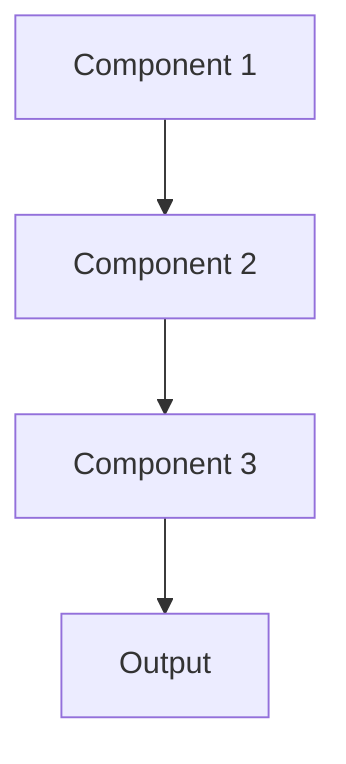

# Xai Pattern

## Overview

Explainable AI (XAI) provides human-understandable explanations of model predictions, helping clinicians understand why a summary included certain information or what input features drove specific outputs. Critical for clinical trust, regulatory compliance, and identifying model failures in healthcare applications.

## When to Use

- **Clinical decision support**: Physicians need to understand and trust model outputs
- **Regulatory requirements**: FDA, EU AI Act require explainability for high-risk medical AI
- **Model debugging**: Understanding why model makes mistakes
- **Building trust**: Clinicians skeptical of black-box AI
- **Error analysis**: Identifying systematic model failures or biases

## When Not to Use

- **Low stakes**: Non-critical applications where trust is less important
- **Expert users**: Users understand model internals already
- **Performance critical**: Explanation generation too slow for use case
- **No audience**: Nobody will actually use explanations
- **Inherently interpretable**: Simple models (linear, decision trees) already transparent

## Architecture



## Implementation Examples

### Vertex AI (Google Cloud) Implementation

```python
# Implementation example using Vertex AI
```

### LangChain Implementation

```python
# Implementation example using LangChain
```

### Anthropic (Claude) Implementation

```python
# Implementation example using Anthropic
```

### Ollama Implementation

```python
# Implementation example using Ollama
```

## Performance Characteristics

### Latency
- [Latency characteristics]

### Throughput
- [Throughput characteristics]

### Resource Usage
- [Resource usage characteristics]

## Trade-offs

### Advantages
- [Advantage 1]
- [Advantage 2]

### Disadvantages
- [Disadvantage 1]
- [Disadvantage 2]

## Use Cases

### Healthcare Summarization
- [Healthcare use case 1]
- [Healthcare use case 2]

### General Use Cases
- [General use case 1]
- [General use case 2]

## Well-Architected Framework Alignment

### Operational Excellence
- [Operational excellence considerations]

### Security
- [Security considerations]

### Reliability
- [Reliability considerations]

### Cost Optimization
- [Cost optimization considerations]

### Performance
- [Performance considerations]

### Sustainability
- [Sustainability considerations]

## Deployment Considerations

### Zonal Deployment
- [Zonal deployment considerations]

### Regional Deployment
- [Regional deployment considerations]

### Multi-Regional Deployment
- [Multi-regional deployment considerations]

### Hybrid Deployment
- [Hybrid deployment considerations]

## Related Patterns
- [Related Pattern 1](./related-pattern-1.md)
- [Related Pattern 2](./related-pattern-2.md)

## References
- [Reference 1]
- [Reference 2]

## Version History
- **v1.0** (YYYY-MM-DD): Initial version

