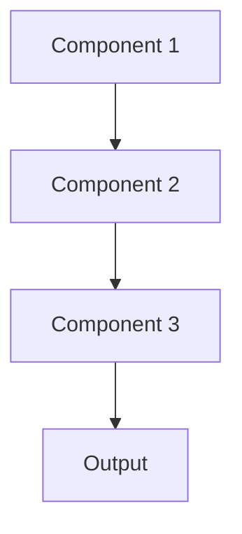

# Api first Pattern

## Overview

API-First Design treats APIs as first-class products, designing and documenting them before implementation, ensuring consistent developer experience. For healthcare AI, this means well-designed summarization APIs that healthcare developers can easily integrate into EHR systems, with clear contracts and comprehensive documentation.

## When to Use

- **External developers**: APIs consumed by third-party developers or partners
- **Multiple clients**: Web, mobile, EHR integrations all using same API
- **Contract-first**: Frontend and backend teams work in parallel
- **API as product**: API is primary interface to your healthcare AI capabilities
- **Standards compliance**: Adhering to FHIR or other healthcare API standards

## When Not to Use

- **Internal only**: APIs only used by same team that builds them
- **Rapid iteration**: API design still highly experimental
- **Simple integration**: Single client; formal API design overkill
- **Legacy systems**: Working with existing APIs that can't be redesigned
- **Time constraints**: Need working system immediately; can't invest in API design

## Architecture



## Implementation Examples

### Vertex AI (Google Cloud) Implementation

```python
# Implementation example using Vertex AI
```

### LangChain Implementation

```python
# Implementation example using LangChain
```

### Anthropic (Claude) Implementation

```python
# Implementation example using Anthropic
```

### Ollama Implementation

```python
# Implementation example using Ollama
```

## Performance Characteristics

### Latency
- [Latency characteristics]

### Throughput
- [Throughput characteristics]

### Resource Usage
- [Resource usage characteristics]

## Trade-offs

### Advantages
- [Advantage 1]
- [Advantage 2]

### Disadvantages
- [Disadvantage 1]
- [Disadvantage 2]

## Use Cases

### Healthcare Summarization
- [Healthcare use case 1]
- [Healthcare use case 2]

### General Use Cases
- [General use case 1]
- [General use case 2]

## Well-Architected Framework Alignment

### Operational Excellence
- [Operational excellence considerations]

### Security
- [Security considerations]

### Reliability
- [Reliability considerations]

### Cost Optimization
- [Cost optimization considerations]

### Performance
- [Performance considerations]

### Sustainability
- [Sustainability considerations]

## Deployment Considerations

### Zonal Deployment
- [Zonal deployment considerations]

### Regional Deployment
- [Regional deployment considerations]

### Multi-Regional Deployment
- [Multi-regional deployment considerations]

### Hybrid Deployment
- [Hybrid deployment considerations]

## Related Patterns
- [Related Pattern 1](./related-pattern-1.md)
- [Related Pattern 2](./related-pattern-2.md)

## References
- [Reference 1]
- [Reference 2]

## Version History
- **v1.0** (YYYY-MM-DD): Initial version

