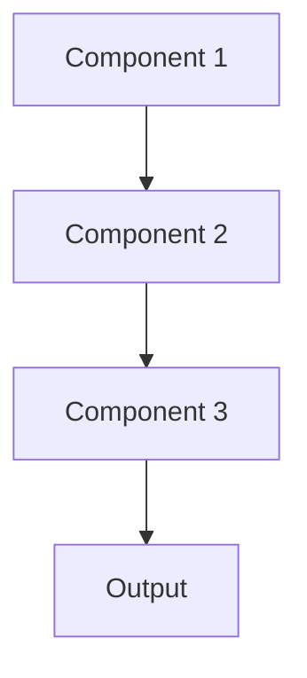

# Api gateway Pattern

## Overview

API Gateway provides a single entry point for multiple backend services, handling routing, authentication, rate limiting, and protocol translation. For healthcare AI, this manages access to summarization models, enforces usage quotas, validates HIPAA compliance, and routes requests to appropriate model versions.

## When to Use

- **Multiple services**: Routing to different models or backend services
- **Cross-cutting concerns**: Authentication, rate limiting, logging across all APIs
- **Legacy integration**: Translating between modern APIs and legacy EHR systems
- **Usage governance**: Enforcing quotas, SLAs, and access policies
- **API versioning**: Managing multiple API versions and deprecation

## When Not to Use

- **Single service**: Only one backend; no routing needed
- **Simple architecture**: Adding gateway increases complexity unnecessarily
- **Latency critical**: Gateway adds network hop and processing overhead
- **Small scale**: Overhead not justified for low-traffic systems
- **Direct integration**: Clients can call services directly

## Architecture



## Implementation Examples

### Vertex AI (Google Cloud) Implementation

```python
# Implementation example using Vertex AI
```

### LangChain Implementation

```python
# Implementation example using LangChain
```

### Anthropic (Claude) Implementation

```python
# Implementation example using Anthropic
```

### Ollama Implementation

```python
# Implementation example using Ollama
```

## Performance Characteristics

### Latency
- [Latency characteristics]

### Throughput
- [Throughput characteristics]

### Resource Usage
- [Resource usage characteristics]

## Trade-offs

### Advantages
- [Advantage 1]
- [Advantage 2]

### Disadvantages
- [Disadvantage 1]
- [Disadvantage 2]

## Use Cases

### Healthcare Summarization
- [Healthcare use case 1]
- [Healthcare use case 2]

### General Use Cases
- [General use case 1]
- [General use case 2]

## Well-Architected Framework Alignment

### Operational Excellence
- [Operational excellence considerations]

### Security
- [Security considerations]

### Reliability
- [Reliability considerations]

### Cost Optimization
- [Cost optimization considerations]

### Performance
- [Performance considerations]

### Sustainability
- [Sustainability considerations]

## Deployment Considerations

### Zonal Deployment
- [Zonal deployment considerations]

### Regional Deployment
- [Regional deployment considerations]

### Multi-Regional Deployment
- [Multi-regional deployment considerations]

### Hybrid Deployment
- [Hybrid deployment considerations]

## Related Patterns
- [Related Pattern 1](./related-pattern-1.md)
- [Related Pattern 2](./related-pattern-2.md)

## References
- [Reference 1]
- [Reference 2]

## Version History
- **v1.0** (YYYY-MM-DD): Initial version

