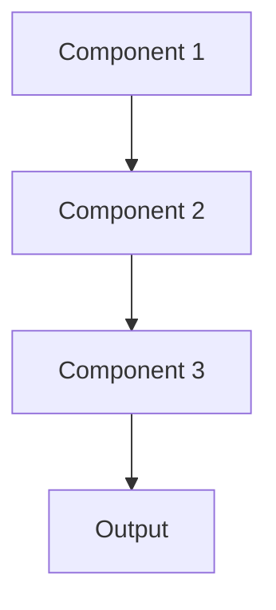

# Graphql Pattern

## Overview

GraphQL provides flexible query language allowing clients to request exactly the data they need, avoiding over/under-fetching. For healthcare AI, this lets EHR interfaces query patient summaries with precisely the fields needed (diagnoses, medications, recent notes) in a single request, reducing API calls and improving performance.

## When to Use

- **Flexible data needs**: Different clients need different subsets of data
- **Multiple resources**: Queries span multiple related entities (patients, visits, summaries)
- **Mobile/bandwidth constrained**: Minimizing data transfer important
- **Rapid iteration**: Frontend teams can add fields without backend changes
- **Aggregation**: Combining data from multiple microservices

## When Not to Use

- **Simple queries**: REST sufficient for straightforward data access
- **File uploads**: REST better suited for document/file uploads
- **Caching requirements**: GraphQL caching more complex than REST
- **Learning curve**: Team lacks GraphQL expertise
- **Legacy integration**: Existing REST APIs can't be replaced

## Architecture



## Implementation Examples

### Vertex AI (Google Cloud) Implementation

```python
# Implementation example using Vertex AI
```

### LangChain Implementation

```python
# Implementation example using LangChain
```

### Anthropic (Claude) Implementation

```python
# Implementation example using Anthropic
```

### Ollama Implementation

```python
# Implementation example using Ollama
```

## Performance Characteristics

### Latency
- [Latency characteristics]

### Throughput
- [Throughput characteristics]

### Resource Usage
- [Resource usage characteristics]

## Trade-offs

### Advantages
- [Advantage 1]
- [Advantage 2]

### Disadvantages
- [Disadvantage 1]
- [Disadvantage 2]

## Use Cases

### Healthcare Summarization
- [Healthcare use case 1]
- [Healthcare use case 2]

### General Use Cases
- [General use case 1]
- [General use case 2]

## Well-Architected Framework Alignment

### Operational Excellence
- [Operational excellence considerations]

### Security
- [Security considerations]

### Reliability
- [Reliability considerations]

### Cost Optimization
- [Cost optimization considerations]

### Performance
- [Performance considerations]

### Sustainability
- [Sustainability considerations]

## Deployment Considerations

### Zonal Deployment
- [Zonal deployment considerations]

### Regional Deployment
- [Regional deployment considerations]

### Multi-Regional Deployment
- [Multi-regional deployment considerations]

### Hybrid Deployment
- [Hybrid deployment considerations]

## Related Patterns
- [Related Pattern 1](./related-pattern-1.md)
- [Related Pattern 2](./related-pattern-2.md)

## References
- [Reference 1]
- [Reference 2]

## Version History
- **v1.0** (YYYY-MM-DD): Initial version

