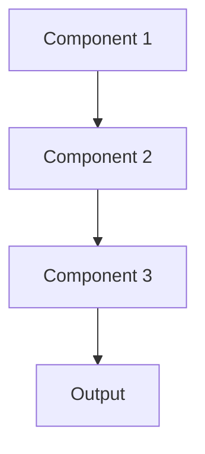

# Service mesh Pattern

## Overview

Service Mesh provides infrastructure layer for service-to-service communication, handling load balancing, encryption, observability, and resilience without application code changes. For healthcare AI microservices, this manages secure communication between summarization components with automatic retries, circuit breaking, and distributed tracing.

## When to Use

- **Many microservices**: Dozens of services with complex communication patterns
- **Security requirements**: Need mutual TLS, encryption for all service communication
- **Observability**: Distributed tracing and metrics across services
- **Resilience**: Automatic retries, circuit breaking, timeout management
- **Traffic management**: Canary deployments, A/B testing at infrastructure level

## When Not to Use

- **Few services**: Small number of services; mesh overhead not justified
- **Simple architecture**: Direct service calls work fine
- **Performance critical**: Mesh proxy adds latency
- **Small team**: Lack expertise to operate service mesh
- **Non-Kubernetes**: Most service meshes designed for Kubernetes environments

## Architecture



## Implementation Examples

### Vertex AI (Google Cloud) Implementation

```python
# Implementation example using Vertex AI
```

### LangChain Implementation

```python
# Implementation example using LangChain
```

### Anthropic (Claude) Implementation

```python
# Implementation example using Anthropic
```

### Ollama Implementation

```python
# Implementation example using Ollama
```

## Performance Characteristics

### Latency
- [Latency characteristics]

### Throughput
- [Throughput characteristics]

### Resource Usage
- [Resource usage characteristics]

## Trade-offs

### Advantages
- [Advantage 1]
- [Advantage 2]

### Disadvantages
- [Disadvantage 1]
- [Disadvantage 2]

## Use Cases

### Healthcare Summarization
- [Healthcare use case 1]
- [Healthcare use case 2]

### General Use Cases
- [General use case 1]
- [General use case 2]

## Well-Architected Framework Alignment

### Operational Excellence
- [Operational excellence considerations]

### Security
- [Security considerations]

### Reliability
- [Reliability considerations]

### Cost Optimization
- [Cost optimization considerations]

### Performance
- [Performance considerations]

### Sustainability
- [Sustainability considerations]

## Deployment Considerations

### Zonal Deployment
- [Zonal deployment considerations]

### Regional Deployment
- [Regional deployment considerations]

### Multi-Regional Deployment
- [Multi-regional deployment considerations]

### Hybrid Deployment
- [Hybrid deployment considerations]

## Related Patterns
- [Related Pattern 1](./related-pattern-1.md)
- [Related Pattern 2](./related-pattern-2.md)

## References
- [Reference 1]
- [Reference 2]

## Version History
- **v1.0** (YYYY-MM-DD): Initial version

