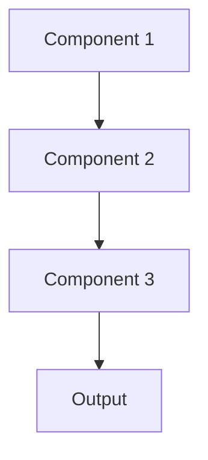

# Model registry Pattern

## Overview

Model Registry provides centralized storage and metadata management for trained models, tracking versions, performance metrics, training data, and deployment status. For healthcare AI, this creates required audit trails, enables model comparison, and manages the lifecycle from experimentation to production to retirement.

## When to Use

- **Multiple models**: Managing many model versions or experiments
- **Team collaboration**: Shared model repository for data science teams
- **Model lifecycle**: Tracking models from training through production to retirement
- **Compliance**: Regulatory requirements for model documentation and provenance
- **Governance**: Need approval workflows and access control for model deployment

## When Not to Use

- **Single model**: Only one model in use; registry overhead not needed
- **Informal tracking**: Spreadsheets or wikis sufficient for small teams
- **Research only**: Not deploying models to production
- **No compliance needs**: No regulatory requirements for model tracking
- **Simple versioning**: File naming conventions adequate

## Architecture



## Implementation Examples

### Vertex AI (Google Cloud) Implementation

```python
# Implementation example using Vertex AI
```

### LangChain Implementation

```python
# Implementation example using LangChain
```

### Anthropic (Claude) Implementation

```python
# Implementation example using Anthropic
```

### Ollama Implementation

```python
# Implementation example using Ollama
```

## Performance Characteristics

### Latency
- [Latency characteristics]

### Throughput
- [Throughput characteristics]

### Resource Usage
- [Resource usage characteristics]

## Trade-offs

### Advantages
- [Advantage 1]
- [Advantage 2]

### Disadvantages
- [Disadvantage 1]
- [Disadvantage 2]

## Use Cases

### Healthcare Summarization
- [Healthcare use case 1]
- [Healthcare use case 2]

### General Use Cases
- [General use case 1]
- [General use case 2]

## Well-Architected Framework Alignment

### Operational Excellence
- [Operational excellence considerations]

### Security
- [Security considerations]

### Reliability
- [Reliability considerations]

### Cost Optimization
- [Cost optimization considerations]

### Performance
- [Performance considerations]

### Sustainability
- [Sustainability considerations]

## Deployment Considerations

### Zonal Deployment
- [Zonal deployment considerations]

### Regional Deployment
- [Regional deployment considerations]

### Multi-Regional Deployment
- [Multi-regional deployment considerations]

### Hybrid Deployment
- [Hybrid deployment considerations]

## Related Patterns
- [Related Pattern 1](./related-pattern-1.md)
- [Related Pattern 2](./related-pattern-2.md)

## References
- [Reference 1]
- [Reference 2]

## Version History
- **v1.0** (YYYY-MM-DD): Initial version

