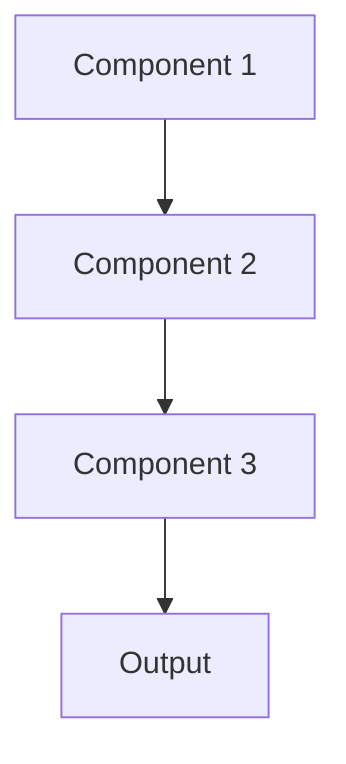

# Modular architecture Pattern

## Overview

Modular Architecture decomposes the AI system into independent, interchangeable components with well-defined interfaces. Each module handles a specific function (e.g., document loading, chunking, embedding, retrieval, generation), enabling flexible composition, testing, and replacement of individual components without affecting the entire system.

## When to Use

- **Complex systems**: Large AI pipelines with multiple distinct stages
- **Team collaboration**: Different teams can work on separate modules independently
- **Flexibility needed**: Ability to swap components (e.g., change embedding model without rewriting retrieval logic)
- **Testing requirements**: Each module can be tested in isolation
- **Vendor flexibility**: Ability to switch between different LLM providers or vector databases

## When Not to Use

- **Simple applications**: Single-purpose tools don't benefit from modularity overhead
- **Tight coupling required**: Components need deep integration for performance
- **Rapid prototyping**: Early-stage development where architecture isn't stable
- **Performance critical**: Module boundaries can add latency
- **Small team**: Overhead of defining and maintaining interfaces isn't justified

## Architecture



## Implementation Examples

### Vertex AI (Google Cloud) Implementation

```python
# Implementation example using Vertex AI
```

### LangChain Implementation

```python
# Implementation example using LangChain
```

### Anthropic (Claude) Implementation

```python
# Implementation example using Anthropic
```

### Ollama Implementation

```python
# Implementation example using Ollama
```

## Performance Characteristics

### Latency
- [Latency characteristics]

### Throughput
- [Throughput characteristics]

### Resource Usage
- [Resource usage characteristics]

## Trade-offs

### Advantages
- [Advantage 1]
- [Advantage 2]

### Disadvantages
- [Disadvantage 1]
- [Disadvantage 2]

## Use Cases

### Healthcare Summarization
- [Healthcare use case 1]
- [Healthcare use case 2]

### General Use Cases
- [General use case 1]
- [General use case 2]

## Well-Architected Framework Alignment

### Operational Excellence
- [Operational excellence considerations]

### Security
- [Security considerations]

### Reliability
- [Reliability considerations]

### Cost Optimization
- [Cost optimization considerations]

### Performance
- [Performance considerations]

### Sustainability
- [Sustainability considerations]

## Deployment Considerations

### Zonal Deployment
- [Zonal deployment considerations]

### Regional Deployment
- [Regional deployment considerations]

### Multi-Regional Deployment
- [Multi-regional deployment considerations]

### Hybrid Deployment
- [Hybrid deployment considerations]

## Related Patterns
- [Related Pattern 1](./related-pattern-1.md)
- [Related Pattern 2](./related-pattern-2.md)

## References
- [Reference 1]
- [Reference 2]

## Version History
- **v1.0** (YYYY-MM-DD): Initial version

