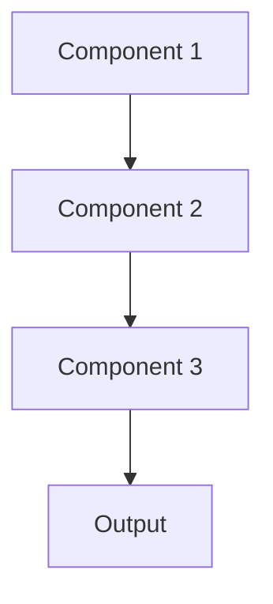

# Transfer learning Pattern

## Overview

Transfer Learning leverages knowledge from pre-trained models to accelerate learning on new, related tasks. Instead of training from scratch, this pattern fine-tunes models trained on large general datasets for specific healthcare domains. Foundation models like Claude, GPT-4, and Gemini use transfer learning principles, where general language understanding is adapted to medical summarization through prompt engineering or fine-tuning.

## When to Use

- **Limited labeled data**: Healthcare datasets are often small due to privacy constraints
- **Domain adaptation**: Adapting general language models to medical terminology and clinical workflows
- **Fast development**: Leveraging pre-trained models reduces training time from months to hours/days
- **Cost optimization**: Fine-tuning is cheaper than training large models from scratch
- **Proven architecture**: Using battle-tested model architectures (Transformers, BERT, GPT)

## When Not to Use

- **Highly specialized domains**: When source and target domains are too different (rare in healthcare AI)
- **Privacy concerns**: Pre-trained models may have seen sensitive training data
- **Performance critical**: Sometimes domain-specific models outperform transferred models
- **Complete control needed**: When you need to understand every aspect of model behavior
- **Regulatory requirements**: Some healthcare regulations may require training provenance

## Architecture



## Implementation Examples

### Vertex AI (Google Cloud) Implementation

```python
# Implementation example using Vertex AI
```

### LangChain Implementation

```python
# Implementation example using LangChain
```

### Anthropic (Claude) Implementation

```python
# Implementation example using Anthropic
```

### Ollama Implementation

```python
# Implementation example using Ollama
```

## Performance Characteristics

### Latency
- [Latency characteristics]

### Throughput
- [Throughput characteristics]

### Resource Usage
- [Resource usage characteristics]

## Trade-offs

### Advantages
- [Advantage 1]
- [Advantage 2]

### Disadvantages
- [Disadvantage 1]
- [Disadvantage 2]

## Use Cases

### Healthcare Summarization
- [Healthcare use case 1]
- [Healthcare use case 2]

### General Use Cases
- [General use case 1]
- [General use case 2]

## Well-Architected Framework Alignment

### Operational Excellence
- [Operational excellence considerations]

### Security
- [Security considerations]

### Reliability
- [Reliability considerations]

### Cost Optimization
- [Cost optimization considerations]

### Performance
- [Performance considerations]

### Sustainability
- [Sustainability considerations]

## Deployment Considerations

### Zonal Deployment
- [Zonal deployment considerations]

### Regional Deployment
- [Regional deployment considerations]

### Multi-Regional Deployment
- [Multi-regional deployment considerations]

### Hybrid Deployment
- [Hybrid deployment considerations]

## Related Patterns
- [Related Pattern 1](./related-pattern-1.md)
- [Related Pattern 2](./related-pattern-2.md)

## References
- [Reference 1]
- [Reference 2]

## Version History
- **v1.0** (YYYY-MM-DD): Initial version

