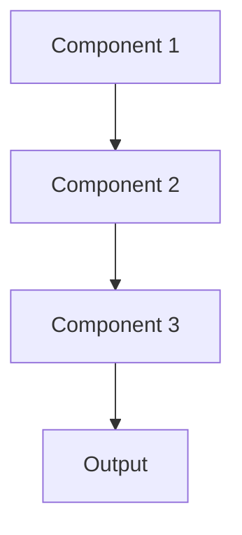

# Alerting Pattern

## Overview

Alerting Pattern notifies operators when monitored metrics exceed thresholds or anomalies are detected, enabling rapid response to system failures or model degradation. For healthcare AI, this means paging on-call engineers if summarization API goes down or model accuracy drops below safety thresholds.

## When to Use

- **Critical systems**: Failures impact patient care or safety
- **24/7 operations**: System must be available around the clock
- **Rapid response needed**: Quick action can prevent or minimize impact
- **Monitoring in place**: Already collecting metrics to alert on
- **Clear thresholds**: Know what metric values indicate problems

## When Not to Use

- **No response capability**: Can't act on alerts anyway
- **Batch systems**: Delays of hours/days acceptable
- **Alert fatigue**: Too many false positives; team ignores alerts
- **Manual monitoring**: Someone always watching dashboards
- **Research phase**: Experimental systems without users to impact

## Architecture



## Implementation Examples

### Vertex AI (Google Cloud) Implementation

```python
# Implementation example using Vertex AI
```

### LangChain Implementation

```python
# Implementation example using LangChain
```

### Anthropic (Claude) Implementation

```python
# Implementation example using Anthropic
```

### Ollama Implementation

```python
# Implementation example using Ollama
```

## Performance Characteristics

### Latency
- [Latency characteristics]

### Throughput
- [Throughput characteristics]

### Resource Usage
- [Resource usage characteristics]

## Trade-offs

### Advantages
- [Advantage 1]
- [Advantage 2]

### Disadvantages
- [Disadvantage 1]
- [Disadvantage 2]

## Use Cases

### Healthcare Summarization
- [Healthcare use case 1]
- [Healthcare use case 2]

### General Use Cases
- [General use case 1]
- [General use case 2]

## Well-Architected Framework Alignment

### Operational Excellence
- [Operational excellence considerations]

### Security
- [Security considerations]

### Reliability
- [Reliability considerations]

### Cost Optimization
- [Cost optimization considerations]

### Performance
- [Performance considerations]

### Sustainability
- [Sustainability considerations]

## Deployment Considerations

### Zonal Deployment
- [Zonal deployment considerations]

### Regional Deployment
- [Regional deployment considerations]

### Multi-Regional Deployment
- [Multi-regional deployment considerations]

### Hybrid Deployment
- [Hybrid deployment considerations]

## Related Patterns
- [Related Pattern 1](./related-pattern-1.md)
- [Related Pattern 2](./related-pattern-2.md)

## References
- [Reference 1]
- [Reference 2]

## Version History
- **v1.0** (YYYY-MM-DD): Initial version

