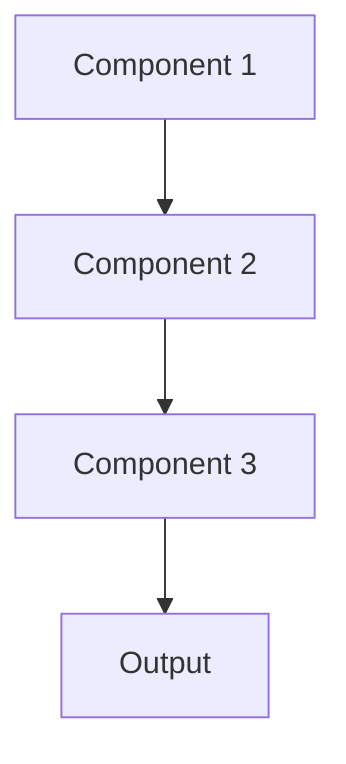

# Anomaly detection Pattern

## Overview

Anomaly Detection identifies unusual patterns in inputs or outputs that deviate from normal behavior, flagging potential data quality issues, system failures, or adversarial inputs. For healthcare, this catches corrupted clinical data, impossible vital signs, or suspicious input patterns before they cause incorrect summaries.

## When to Use

- **Data quality**: Need to detect corrupted or invalid clinical data
- **System failures**: Identify upstream data pipeline failures
- **Security**: Detect adversarial or malicious inputs
- **Safety critical**: Unusual inputs might cause dangerous predictions
- **Unknown unknowns**: Can't enumerate all possible failure modes

## When Not to Use

- **Known error modes**: Can validate against specific rules instead
- **High false positives**: Anomaly detection may flag too many false alarms
- **Rapid changes**: What's 'normal' changes too quickly to establish baselines
- **All data reviewed**: Humans review all inputs/outputs anyway
- **Simple validation**: Basic range checks and schema validation sufficient

## Architecture



## Implementation Examples

### Vertex AI (Google Cloud) Implementation

```python
# Implementation example using Vertex AI
```

### LangChain Implementation

```python
# Implementation example using LangChain
```

### Anthropic (Claude) Implementation

```python
# Implementation example using Anthropic
```

### Ollama Implementation

```python
# Implementation example using Ollama
```

## Performance Characteristics

### Latency
- [Latency characteristics]

### Throughput
- [Throughput characteristics]

### Resource Usage
- [Resource usage characteristics]

## Trade-offs

### Advantages
- [Advantage 1]
- [Advantage 2]

### Disadvantages
- [Disadvantage 1]
- [Disadvantage 2]

## Use Cases

### Healthcare Summarization
- [Healthcare use case 1]
- [Healthcare use case 2]

### General Use Cases
- [General use case 1]
- [General use case 2]

## Well-Architected Framework Alignment

### Operational Excellence
- [Operational excellence considerations]

### Security
- [Security considerations]

### Reliability
- [Reliability considerations]

### Cost Optimization
- [Cost optimization considerations]

### Performance
- [Performance considerations]

### Sustainability
- [Sustainability considerations]

## Deployment Considerations

### Zonal Deployment
- [Zonal deployment considerations]

### Regional Deployment
- [Regional deployment considerations]

### Multi-Regional Deployment
- [Multi-regional deployment considerations]

### Hybrid Deployment
- [Hybrid deployment considerations]

## Related Patterns
- [Related Pattern 1](./related-pattern-1.md)
- [Related Pattern 2](./related-pattern-2.md)

## References
- [Reference 1]
- [Reference 2]

## Version History
- **v1.0** (YYYY-MM-DD): Initial version

