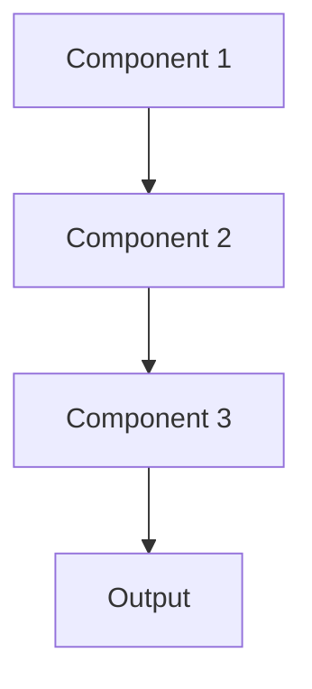

# Performance monitoring Pattern

## Overview

Performance Monitoring tracks system-level metrics like latency, throughput, resource utilization, and uptime to ensure ML systems meet SLAs. For healthcare AI, this monitors API response times, GPU utilization, and system availability to ensure clinical workflows aren't disrupted by slow or failing summarization services.

## When to Use

- **Production systems**: Serving real clinical users with SLA requirements
- **Real-time applications**: Latency affects user experience
- **Resource optimization**: Need to right-size infrastructure and reduce costs
- **Capacity planning**: Understanding usage patterns to plan scaling
- **Incident response**: Quickly identify and diagnose system issues

## When Not to Use

- **Batch processing**: No latency requirements
- **Research phase**: Experimental systems without users
- **Single user**: Performance issues don't affect others
- **Over-provisioned**: Have far more resources than needed; performance not a concern
- **Simple systems**: Complexity doesn't justify monitoring overhead

## Architecture



## Implementation Examples

### Vertex AI (Google Cloud) Implementation

```python
# Implementation example using Vertex AI
```

### LangChain Implementation

```python
# Implementation example using LangChain
```

### Anthropic (Claude) Implementation

```python
# Implementation example using Anthropic
```

### Ollama Implementation

```python
# Implementation example using Ollama
```

## Performance Characteristics

### Latency
- [Latency characteristics]

### Throughput
- [Throughput characteristics]

### Resource Usage
- [Resource usage characteristics]

## Trade-offs

### Advantages
- [Advantage 1]
- [Advantage 2]

### Disadvantages
- [Disadvantage 1]
- [Disadvantage 2]

## Use Cases

### Healthcare Summarization
- [Healthcare use case 1]
- [Healthcare use case 2]

### General Use Cases
- [General use case 1]
- [General use case 2]

## Well-Architected Framework Alignment

### Operational Excellence
- [Operational excellence considerations]

### Security
- [Security considerations]

### Reliability
- [Reliability considerations]

### Cost Optimization
- [Cost optimization considerations]

### Performance
- [Performance considerations]

### Sustainability
- [Sustainability considerations]

## Deployment Considerations

### Zonal Deployment
- [Zonal deployment considerations]

### Regional Deployment
- [Regional deployment considerations]

### Multi-Regional Deployment
- [Multi-regional deployment considerations]

### Hybrid Deployment
- [Hybrid deployment considerations]

## Related Patterns
- [Related Pattern 1](./related-pattern-1.md)
- [Related Pattern 2](./related-pattern-2.md)

## References
- [Reference 1]
- [Reference 2]

## Version History
- **v1.0** (YYYY-MM-DD): Initial version

