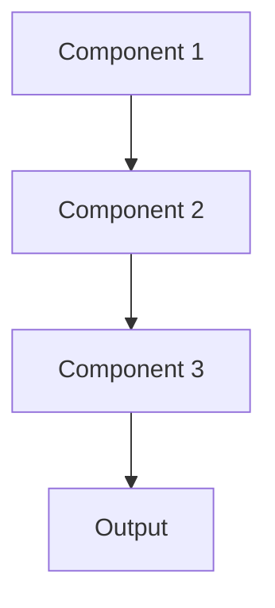

# Model optimization Pattern

## Overview

Model Optimization improves inference speed, reduces memory footprint, and lowers computational costs through techniques like quantization, pruning, and knowledge distillation. For healthcare AI, this enables deploying large language models on cost-effective infrastructure or edge devices while maintaining clinical accuracy.

## When to Use

- **Latency requirements**: Need faster inference for real-time clinical workflows
- **Cost reduction**: Cloud API costs too high for production scale
- **Edge deployment**: Must run models on devices with limited compute/memory
- **High throughput**: Processing thousands of summaries per hour
- **Resource constraints**: GPU memory or compute limited

## When Not to Use

- **Accuracy critical**: Optimization might reduce clinical accuracy unacceptably
- **Sufficient performance**: Current speed and cost acceptable
- **Complexity**: Optimization effort not justified by benefits
- **Research phase**: Premature optimization for experimental models
- **Small scale**: Low request volume; optimization unnecessary

## Architecture



## Implementation Examples

### Vertex AI (Google Cloud) Implementation

```python
# Implementation example using Vertex AI
```

### LangChain Implementation

```python
# Implementation example using LangChain
```

### Anthropic (Claude) Implementation

```python
# Implementation example using Anthropic
```

### Ollama Implementation

```python
# Implementation example using Ollama
```

## Performance Characteristics

### Latency
- [Latency characteristics]

### Throughput
- [Throughput characteristics]

### Resource Usage
- [Resource usage characteristics]

## Trade-offs

### Advantages
- [Advantage 1]
- [Advantage 2]

### Disadvantages
- [Disadvantage 1]
- [Disadvantage 2]

## Use Cases

### Healthcare Summarization
- [Healthcare use case 1]
- [Healthcare use case 2]

### General Use Cases
- [General use case 1]
- [General use case 2]

## Well-Architected Framework Alignment

### Operational Excellence
- [Operational excellence considerations]

### Security
- [Security considerations]

### Reliability
- [Reliability considerations]

### Cost Optimization
- [Cost optimization considerations]

### Performance
- [Performance considerations]

### Sustainability
- [Sustainability considerations]

## Deployment Considerations

### Zonal Deployment
- [Zonal deployment considerations]

### Regional Deployment
- [Regional deployment considerations]

### Multi-Regional Deployment
- [Multi-regional deployment considerations]

### Hybrid Deployment
- [Hybrid deployment considerations]

## Related Patterns
- [Related Pattern 1](./related-pattern-1.md)
- [Related Pattern 2](./related-pattern-2.md)

## References
- [Reference 1]
- [Reference 2]

## Version History
- **v1.0** (YYYY-MM-DD): Initial version

