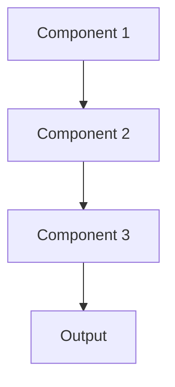

# Pruning Pattern

## Overview

Pruning removes unnecessary weights, neurons, or entire layers from neural networks, creating smaller, faster models with minimal accuracy loss. For healthcare AI, this reduces the size of fine-tuned medical LLMs while preserving clinical knowledge, enabling faster inference and lower deployment costs.

## When to Use

- **Model size reduction**: Model too large for deployment constraints
- **Inference speed**: Fewer parameters mean faster predictions
- **Over-parameterized models**: Large models with redundant capacity
- **Resource constraints**: Limited memory or compute for deployment
- **Minimal accuracy loss**: Pruning doesn't significantly impact clinical performance

## When Not to Use

- **Compact models**: Model already minimal size for task
- **Accuracy critical**: Cannot tolerate any performance degradation
- **Training overhead**: Pruning requires retraining or fine-tuning
- **Structured pruning limitations**: Hardware doesn't benefit from unstructured pruning
- **Complexity**: Implementation and validation effort not justified

## Architecture



## Implementation Examples

### Vertex AI (Google Cloud) Implementation

```python
# Implementation example using Vertex AI
```

### LangChain Implementation

```python
# Implementation example using LangChain
```

### Anthropic (Claude) Implementation

```python
# Implementation example using Anthropic
```

### Ollama Implementation

```python
# Implementation example using Ollama
```

## Performance Characteristics

### Latency
- [Latency characteristics]

### Throughput
- [Throughput characteristics]

### Resource Usage
- [Resource usage characteristics]

## Trade-offs

### Advantages
- [Advantage 1]
- [Advantage 2]

### Disadvantages
- [Disadvantage 1]
- [Disadvantage 2]

## Use Cases

### Healthcare Summarization
- [Healthcare use case 1]
- [Healthcare use case 2]

### General Use Cases
- [General use case 1]
- [General use case 2]

## Well-Architected Framework Alignment

### Operational Excellence
- [Operational excellence considerations]

### Security
- [Security considerations]

### Reliability
- [Reliability considerations]

### Cost Optimization
- [Cost optimization considerations]

### Performance
- [Performance considerations]

### Sustainability
- [Sustainability considerations]

## Deployment Considerations

### Zonal Deployment
- [Zonal deployment considerations]

### Regional Deployment
- [Regional deployment considerations]

### Multi-Regional Deployment
- [Multi-regional deployment considerations]

### Hybrid Deployment
- [Hybrid deployment considerations]

## Related Patterns
- [Related Pattern 1](./related-pattern-1.md)
- [Related Pattern 2](./related-pattern-2.md)

## References
- [Reference 1]
- [Reference 2]

## Version History
- **v1.0** (YYYY-MM-DD): Initial version

