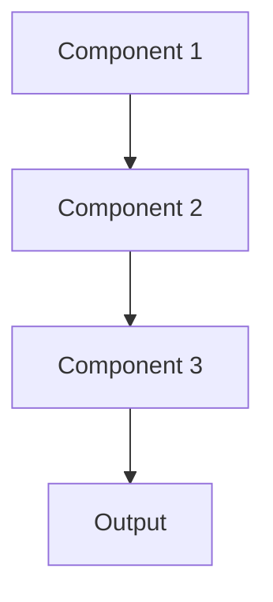

# Adversarial defense Pattern

## Overview

Adversarial Defense protects ML models against malicious inputs designed to cause incorrect predictions. For healthcare AI, this guards against manipulated clinical notes intended to generate false summaries, or prompt injection attacks trying to extract training data or override safety constraints.

## When to Use

- **User-supplied inputs**: Accepting clinical text from potentially untrusted sources
- **High-stakes decisions**: Adversarial attacks could harm patients
- **Public-facing**: Systems accessible to external users or attackers
- **Automated decisions**: Model outputs used without human review
- **Known attack vectors**: Specific adversarial threats identified

## When Not to Use

- **Trusted inputs only**: All data from verified, controlled sources
- **Human review**: Experts review all model outputs
- **Low-value target**: System not attractive to attackers
- **Research phase**: Security hardening premature for experimental systems
- **Detection sufficient**: Can detect attacks without preventing them

## Architecture



## Implementation Examples

### Vertex AI (Google Cloud) Implementation

```python
# Implementation example using Vertex AI
```

### LangChain Implementation

```python
# Implementation example using LangChain
```

### Anthropic (Claude) Implementation

```python
# Implementation example using Anthropic
```

### Ollama Implementation

```python
# Implementation example using Ollama
```

## Performance Characteristics

### Latency
- [Latency characteristics]

### Throughput
- [Throughput characteristics]

### Resource Usage
- [Resource usage characteristics]

## Trade-offs

### Advantages
- [Advantage 1]
- [Advantage 2]

### Disadvantages
- [Disadvantage 1]
- [Disadvantage 2]

## Use Cases

### Healthcare Summarization
- [Healthcare use case 1]
- [Healthcare use case 2]

### General Use Cases
- [General use case 1]
- [General use case 2]

## Well-Architected Framework Alignment

### Operational Excellence
- [Operational excellence considerations]

### Security
- [Security considerations]

### Reliability
- [Reliability considerations]

### Cost Optimization
- [Cost optimization considerations]

### Performance
- [Performance considerations]

### Sustainability
- [Sustainability considerations]

## Deployment Considerations

### Zonal Deployment
- [Zonal deployment considerations]

### Regional Deployment
- [Regional deployment considerations]

### Multi-Regional Deployment
- [Multi-regional deployment considerations]

### Hybrid Deployment
- [Hybrid deployment considerations]

## Related Patterns
- [Related Pattern 1](./related-pattern-1.md)
- [Related Pattern 2](./related-pattern-2.md)

## References
- [Reference 1]
- [Reference 2]

## Version History
- **v1.0** (YYYY-MM-DD): Initial version

