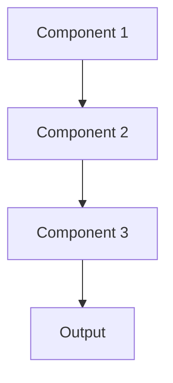

# Homomorphic encryption Pattern

## Overview

Homomorphic Encryption allows computations on encrypted data without decrypting it, enabling ML inference on sensitive patient data while it remains encrypted end-to-end. Healthcare providers can send encrypted clinical notes for summarization without cloud services ever seeing plaintext PHI.

## When to Use

- **Zero trust**: Cannot trust cloud provider or model operator with plaintext data
- **Regulatory constraints**: Regulations prohibit sending unencrypted PHI to cloud
- **Shared infrastructure**: Using third-party ML services with patient data
- **Compliance**: Meeting strictest data protection requirements
- **International**: Data residency laws prevent moving data across borders

## When Not to Use

- **Performance critical**: Homomorphic encryption adds 100-1000x overhead
- **Trusted environment**: Cloud provider already HIPAA-compliant with BAA
- **Training**: Current homomorphic techniques mainly support inference, not training
- **Complex models**: Large neural networks may be impractical
- **Complexity**: Lack expertise or tooling to implement

## Architecture



## Implementation Examples

### Vertex AI (Google Cloud) Implementation

```python
# Implementation example using Vertex AI
```

### LangChain Implementation

```python
# Implementation example using LangChain
```

### Anthropic (Claude) Implementation

```python
# Implementation example using Anthropic
```

### Ollama Implementation

```python
# Implementation example using Ollama
```

## Performance Characteristics

### Latency
- [Latency characteristics]

### Throughput
- [Throughput characteristics]

### Resource Usage
- [Resource usage characteristics]

## Trade-offs

### Advantages
- [Advantage 1]
- [Advantage 2]

### Disadvantages
- [Disadvantage 1]
- [Disadvantage 2]

## Use Cases

### Healthcare Summarization
- [Healthcare use case 1]
- [Healthcare use case 2]

### General Use Cases
- [General use case 1]
- [General use case 2]

## Well-Architected Framework Alignment

### Operational Excellence
- [Operational excellence considerations]

### Security
- [Security considerations]

### Reliability
- [Reliability considerations]

### Cost Optimization
- [Cost optimization considerations]

### Performance
- [Performance considerations]

### Sustainability
- [Sustainability considerations]

## Deployment Considerations

### Zonal Deployment
- [Zonal deployment considerations]

### Regional Deployment
- [Regional deployment considerations]

### Multi-Regional Deployment
- [Multi-regional deployment considerations]

### Hybrid Deployment
- [Hybrid deployment considerations]

## Related Patterns
- [Related Pattern 1](./related-pattern-1.md)
- [Related Pattern 2](./related-pattern-2.md)

## References
- [Reference 1]
- [Reference 2]

## Version History
- **v1.0** (YYYY-MM-DD): Initial version

