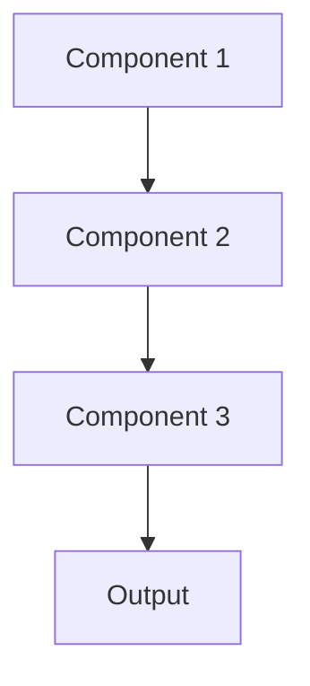

# Model watermarking Pattern

## Overview

Model Watermarking embeds hidden markers into ML models to prove ownership, detect unauthorized use, and trace model leaks. For healthcare AI, this protects proprietary medical summarization models from theft and enables detecting if models are being used without proper licensing or safety oversight.

## When to Use

- **Proprietary models**: Valuable models you've invested significantly in developing
- **Model distribution**: Deploying models to third parties or edge devices
- **Intellectual property**: Need to prove model ownership or detect theft
- **Licensing**: Enforcing usage terms or detecting unauthorized deployment
- **Insider threats**: Concerned about employees stealing models

## When Not to Use

- **Open source**: Openly sharing models; watermarking unnecessary
- **Controlled deployment**: Models only in your controlled infrastructure
- **Low value**: Model not valuable enough to justify protection effort
- **Performance impact**: Watermarking might degrade model accuracy
- **Detection unnecessary**: Other means of preventing model theft

## Architecture



## Implementation Examples

### Vertex AI (Google Cloud) Implementation

```python
# Implementation example using Vertex AI
```

### LangChain Implementation

```python
# Implementation example using LangChain
```

### Anthropic (Claude) Implementation

```python
# Implementation example using Anthropic
```

### Ollama Implementation

```python
# Implementation example using Ollama
```

## Performance Characteristics

### Latency
- [Latency characteristics]

### Throughput
- [Throughput characteristics]

### Resource Usage
- [Resource usage characteristics]

## Trade-offs

### Advantages
- [Advantage 1]
- [Advantage 2]

### Disadvantages
- [Disadvantage 1]
- [Disadvantage 2]

## Use Cases

### Healthcare Summarization
- [Healthcare use case 1]
- [Healthcare use case 2]

### General Use Cases
- [General use case 1]
- [General use case 2]

## Well-Architected Framework Alignment

### Operational Excellence
- [Operational excellence considerations]

### Security
- [Security considerations]

### Reliability
- [Reliability considerations]

### Cost Optimization
- [Cost optimization considerations]

### Performance
- [Performance considerations]

### Sustainability
- [Sustainability considerations]

## Deployment Considerations

### Zonal Deployment
- [Zonal deployment considerations]

### Regional Deployment
- [Regional deployment considerations]

### Multi-Regional Deployment
- [Multi-regional deployment considerations]

### Hybrid Deployment
- [Hybrid deployment considerations]

## Related Patterns
- [Related Pattern 1](./related-pattern-1.md)
- [Related Pattern 2](./related-pattern-2.md)

## References
- [Reference 1]
- [Reference 2]

## Version History
- **v1.0** (YYYY-MM-DD): Initial version

