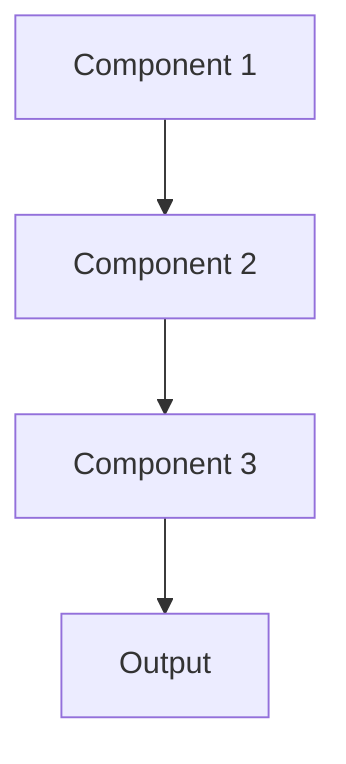

# Privacy preserving ml Pattern

## Overview

Privacy-Preserving ML enables learning from sensitive data while protecting individual privacy through techniques like differential privacy, federated learning, and secure computation. Essential for healthcare AI to comply with HIPAA while training on patient data across institutions without centralizing PHI.

## When to Use

- **Sensitive data**: Training on protected health information (PHI)
- **Privacy regulations**: HIPAA, GDPR require privacy protections
- **Multi-party data**: Multiple hospitals collaborating without sharing raw data
- **Privacy risk**: Re-identification or data leakage could harm patients
- **Consent constraints**: Patients consented to analysis but not data sharing

## When Not to Use

- **De-identified data**: Data already anonymized sufficiently
- **Public data**: Training on publicly available medical literature
- **Single institution**: Data doesn't leave organization; privacy already controlled
- **Performance critical**: Privacy techniques reduce accuracy unacceptably
- **No sensitive attributes**: Data doesn't contain personal information

## Architecture



## Implementation Examples

### Vertex AI (Google Cloud) Implementation

```python
# Implementation example using Vertex AI
```

### LangChain Implementation

```python
# Implementation example using LangChain
```

### Anthropic (Claude) Implementation

```python
# Implementation example using Anthropic
```

### Ollama Implementation

```python
# Implementation example using Ollama
```

## Performance Characteristics

### Latency
- [Latency characteristics]

### Throughput
- [Throughput characteristics]

### Resource Usage
- [Resource usage characteristics]

## Trade-offs

### Advantages
- [Advantage 1]
- [Advantage 2]

### Disadvantages
- [Disadvantage 1]
- [Disadvantage 2]

## Use Cases

### Healthcare Summarization
- [Healthcare use case 1]
- [Healthcare use case 2]

### General Use Cases
- [General use case 1]
- [General use case 2]

## Well-Architected Framework Alignment

### Operational Excellence
- [Operational excellence considerations]

### Security
- [Security considerations]

### Reliability
- [Reliability considerations]

### Cost Optimization
- [Cost optimization considerations]

### Performance
- [Performance considerations]

### Sustainability
- [Sustainability considerations]

## Deployment Considerations

### Zonal Deployment
- [Zonal deployment considerations]

### Regional Deployment
- [Regional deployment considerations]

### Multi-Regional Deployment
- [Multi-regional deployment considerations]

### Hybrid Deployment
- [Hybrid deployment considerations]

## Related Patterns
- [Related Pattern 1](./related-pattern-1.md)
- [Related Pattern 2](./related-pattern-2.md)

## References
- [Reference 1]
- [Reference 2]

## Version History
- **v1.0** (YYYY-MM-DD): Initial version

