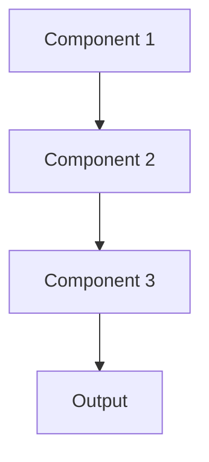

# Active learning Pattern

## Overview

Active Learning selectively chooses the most informative examples for labeling, reducing annotation costs by focusing human effort where it provides maximum value. The model identifies uncertain or representative samples for expert review, improving efficiently with minimal labeled data. Particularly valuable in healthcare where expert annotation is expensive.

## When to Use

- **Limited annotation budget**: Medical experts' time is expensive and scarce
- **Large unlabeled dataset**: Have abundant raw data but few labels
- **Iterative improvement**: Can continuously improve model with new labels
- **Uncertainty quantification**: Model can identify its own weak points
- **Quality over quantity**: Few high-value labels better than many random labels

## When Not to Use

- **Abundant labels**: Already have sufficient labeled data
- **Batch labeling**: Must label all data upfront rather than iteratively
- **Poor initial model**: Active learning requires reasonable starting model
- **No feedback loop**: Can't incorporate new labels into model iteratively
- **Uniform distribution**: All samples equally informative

## Architecture



## Implementation Examples

### Vertex AI (Google Cloud) Implementation

```python
# Implementation example using Vertex AI
```

### LangChain Implementation

```python
# Implementation example using LangChain
```

### Anthropic (Claude) Implementation

```python
# Implementation example using Anthropic
```

### Ollama Implementation

```python
# Implementation example using Ollama
```

## Performance Characteristics

### Latency
- [Latency characteristics]

### Throughput
- [Throughput characteristics]

### Resource Usage
- [Resource usage characteristics]

## Trade-offs

### Advantages
- [Advantage 1]
- [Advantage 2]

### Disadvantages
- [Disadvantage 1]
- [Disadvantage 2]

## Use Cases

### Healthcare Summarization
- [Healthcare use case 1]
- [Healthcare use case 2]

### General Use Cases
- [General use case 1]
- [General use case 2]

## Well-Architected Framework Alignment

### Operational Excellence
- [Operational excellence considerations]

### Security
- [Security considerations]

### Reliability
- [Reliability considerations]

### Cost Optimization
- [Cost optimization considerations]

### Performance
- [Performance considerations]

### Sustainability
- [Sustainability considerations]

## Deployment Considerations

### Zonal Deployment
- [Zonal deployment considerations]

### Regional Deployment
- [Regional deployment considerations]

### Multi-Regional Deployment
- [Multi-regional deployment considerations]

### Hybrid Deployment
- [Hybrid deployment considerations]

## Related Patterns
- [Related Pattern 1](./related-pattern-1.md)
- [Related Pattern 2](./related-pattern-2.md)

## References
- [Reference 1]
- [Reference 2]

## Version History
- **v1.0** (YYYY-MM-DD): Initial version

