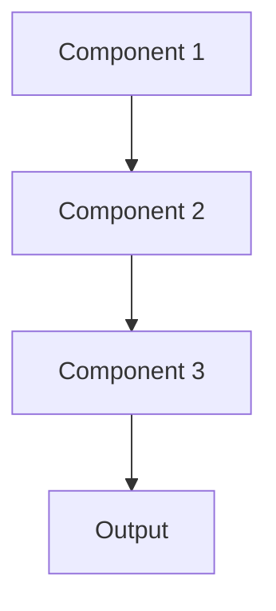

# Federated learning Pattern

## Overview

Federated Learning trains models across distributed datasets without centralizing data, preserving privacy by keeping sensitive information at source. Models train locally on each institution's data, sharing only model updates rather than raw patient records. Critical for healthcare where PHI cannot leave hospital systems due to HIPAA regulations.

## When to Use

- **Privacy regulations**: HIPAA, GDPR prohibit centralizing patient data
- **Multi-institution collaboration**: Multiple hospitals want to collaborate without sharing data
- **Data cannot move**: Technical, legal, or ethical constraints prevent data centralization
- **Heterogeneous data**: Each site has unique patient populations and data characteristics
- **Distributed deployment**: Models will be used locally at each institution

## When Not to Use

- **Centralization possible**: Data can legally and practically be centralized
- **Communication constrained**: Network bandwidth insufficient for model updates
- **Small number of sites**: Overhead not justified for 1-2 institutions
- **Homogeneous data needed**: Require consistent data distribution
- **Performance critical**: Federated learning typically slower than centralized

## Architecture



## Implementation Examples

### Vertex AI (Google Cloud) Implementation

```python
# Implementation example using Vertex AI
```

### LangChain Implementation

```python
# Implementation example using LangChain
```

### Anthropic (Claude) Implementation

```python
# Implementation example using Anthropic
```

### Ollama Implementation

```python
# Implementation example using Ollama
```

## Performance Characteristics

### Latency
- [Latency characteristics]

### Throughput
- [Throughput characteristics]

### Resource Usage
- [Resource usage characteristics]

## Trade-offs

### Advantages
- [Advantage 1]
- [Advantage 2]

### Disadvantages
- [Disadvantage 1]
- [Disadvantage 2]

## Use Cases

### Healthcare Summarization
- [Healthcare use case 1]
- [Healthcare use case 2]

### General Use Cases
- [General use case 1]
- [General use case 2]

## Well-Architected Framework Alignment

### Operational Excellence
- [Operational excellence considerations]

### Security
- [Security considerations]

### Reliability
- [Reliability considerations]

### Cost Optimization
- [Cost optimization considerations]

### Performance
- [Performance considerations]

### Sustainability
- [Sustainability considerations]

## Deployment Considerations

### Zonal Deployment
- [Zonal deployment considerations]

### Regional Deployment
- [Regional deployment considerations]

### Multi-Regional Deployment
- [Multi-regional deployment considerations]

### Hybrid Deployment
- [Hybrid deployment considerations]

## Related Patterns
- [Related Pattern 1](./related-pattern-1.md)
- [Related Pattern 2](./related-pattern-2.md)

## References
- [Reference 1]
- [Reference 2]

## Version History
- **v1.0** (YYYY-MM-DD): Initial version

