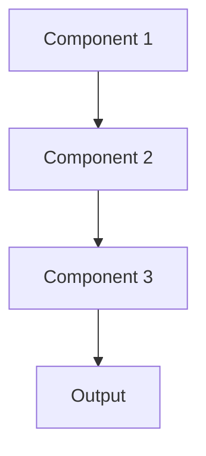

# Few shot learning Pattern

## Overview

Few-Shot Learning enables models to learn new tasks from just a few examples, leveraging prior knowledge to generalize quickly. Large language models like Claude can perform tasks with 1-10 examples in the prompt (in-context learning). Valuable in healthcare for rare conditions or new clinical scenarios where data is scarce.

## When to Use

- **Rare conditions**: Few examples available (orphan diseases, rare complications)
- **New tasks**: Need to adapt quickly to novel summarization requirements
- **Rapid deployment**: No time for extensive data collection and training
- **Personalization**: Customize to specific physician preferences with few examples
- **Foundation models**: Leverage LLMs' in-context learning capabilities

## When Not to Use

- **Abundant data**: Traditional supervised learning more effective
- **Performance critical**: Few-shot typically underperforms full training
- **No foundation model**: Few-shot learning requires strong pre-trained model
- **Consistent task**: Same task repeatedly; worth collecting more data
- **Fine-tuning possible**: If you can fine-tune, it often outperforms few-shot

## Architecture



## Implementation Examples

### Vertex AI (Google Cloud) Implementation

```python
# Implementation example using Vertex AI
```

### LangChain Implementation

```python
# Implementation example using LangChain
```

### Anthropic (Claude) Implementation

```python
# Implementation example using Anthropic
```

### Ollama Implementation

```python
# Implementation example using Ollama
```

## Performance Characteristics

### Latency
- [Latency characteristics]

### Throughput
- [Throughput characteristics]

### Resource Usage
- [Resource usage characteristics]

## Trade-offs

### Advantages
- [Advantage 1]
- [Advantage 2]

### Disadvantages
- [Disadvantage 1]
- [Disadvantage 2]

## Use Cases

### Healthcare Summarization
- [Healthcare use case 1]
- [Healthcare use case 2]

### General Use Cases
- [General use case 1]
- [General use case 2]

## Well-Architected Framework Alignment

### Operational Excellence
- [Operational excellence considerations]

### Security
- [Security considerations]

### Reliability
- [Reliability considerations]

### Cost Optimization
- [Cost optimization considerations]

### Performance
- [Performance considerations]

### Sustainability
- [Sustainability considerations]

## Deployment Considerations

### Zonal Deployment
- [Zonal deployment considerations]

### Regional Deployment
- [Regional deployment considerations]

### Multi-Regional Deployment
- [Multi-regional deployment considerations]

### Hybrid Deployment
- [Hybrid deployment considerations]

## Related Patterns
- [Related Pattern 1](./related-pattern-1.md)
- [Related Pattern 2](./related-pattern-2.md)

## References
- [Reference 1]
- [Reference 2]

## Version History
- **v1.0** (YYYY-MM-DD): Initial version

