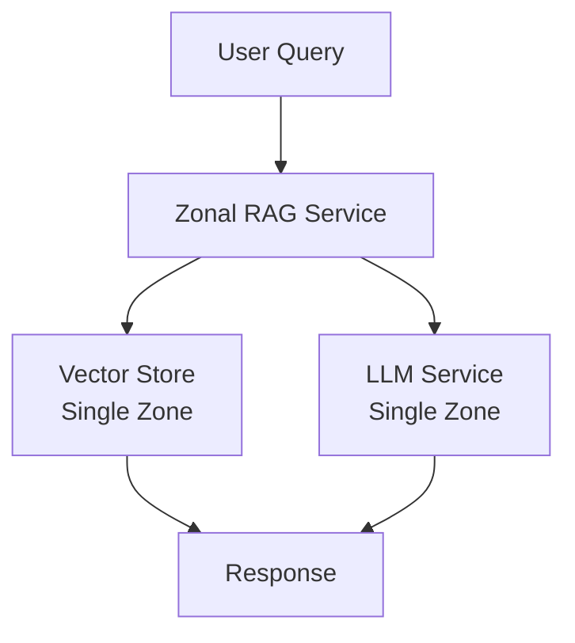
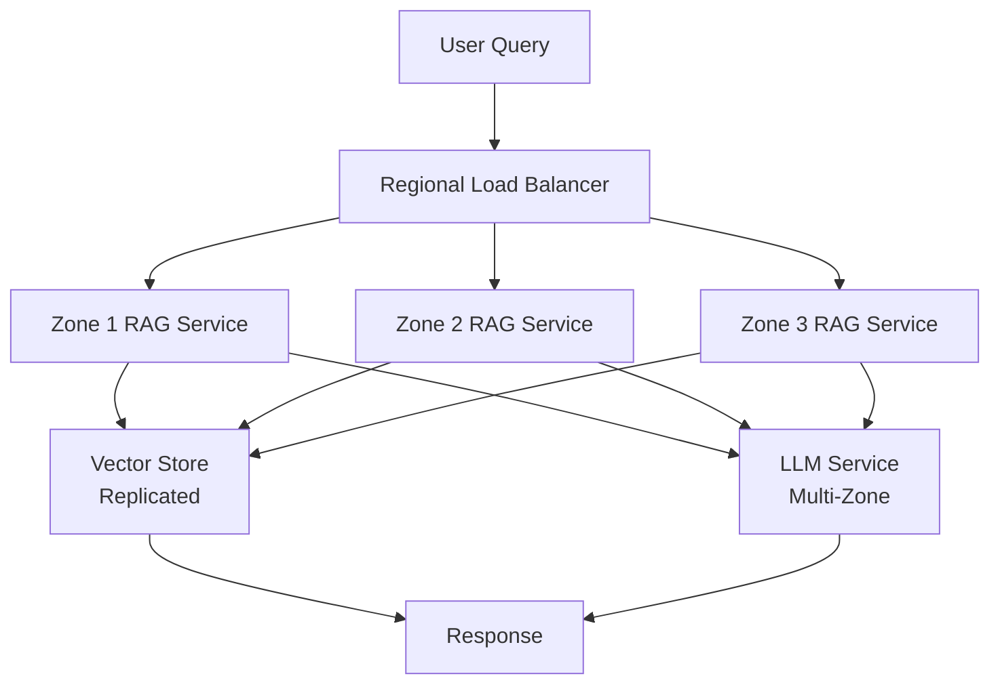
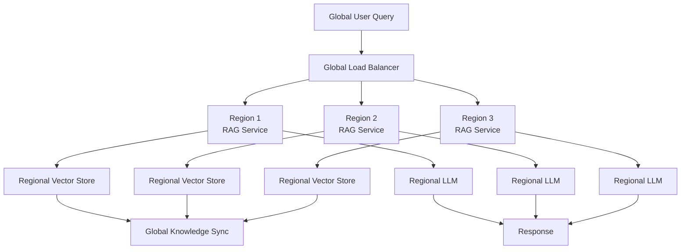
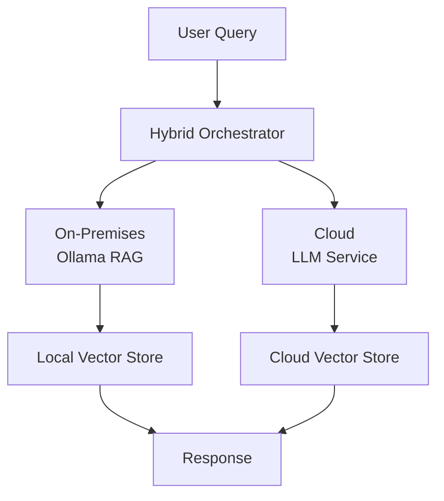

# Deployment Guide: RAG Pattern Deployment Archetypes

This guide applies Google Cloud deployment archetypes to RAG pattern implementations.

## Deployment Archetypes Overview

Based on the [Google Cloud Architecture Framework](https://docs.cloud.google.com/architecture/framework/printable), deployment archetypes define how systems are distributed across infrastructure.

## Zonal Deployment

### Characteristics
- **Scope**: Single zone within a region
- **Availability**: Lower (single point of failure)
- **Cost**: Lowest
- **Complexity**: Simplest

### Suitable RAG Patterns
- **Basic RAG**: Simple, single-zone deployment
- **Local Ollama**: On-premises or single-zone cloud
- **Development/Testing**: Prototype patterns

### Architecture Example



### Use Cases
- Development environments
- Testing and prototyping
- Low-availability requirements
- Cost-sensitive applications
- Local/on-premises deployments

### Implementation Considerations
- Single ChromaDB instance
- Local Ollama deployment
- No cross-zone redundancy
- Simple monitoring setup

## Regional Deployment

### Characteristics
- **Scope**: Multiple zones within a region
- **Availability**: Higher (zone redundancy)
- **Cost**: Moderate
- **Complexity**: Moderate

### Suitable RAG Patterns
- **Advanced RAG**: Multi-step processing benefits from redundancy
- **Hybrid RAG**: Multiple retrieval strategies across zones
- **Self-RAG**: Quality-critical applications need redundancy
- **Production Workloads**: Most production RAG applications

### Architecture Example



### Use Cases
- Production applications
- Moderate availability requirements (99.5-99.9%)
- Regional compliance requirements
- Balanced cost and availability

### Implementation Considerations
- ChromaDB replication across zones
- Multi-zone LLM service deployment
- Zone-aware load balancing
- Cross-zone monitoring

## Multi-Regional Deployment

### Characteristics
- **Scope**: Multiple regions globally
- **Availability**: Highest (region redundancy)
- **Cost**: Highest
- **Complexity**: Highest

### Suitable RAG Patterns
- **Streaming RAG**: Global real-time requirements
- **Graph RAG**: Global knowledge graphs
- **Enterprise RAG**: High-availability enterprise applications
- **Global Applications**: Worldwide user base

### Architecture Example



### Use Cases
- Global applications
- High availability requirements (99.9%+)
- Disaster recovery
- Low-latency global access
- Enterprise-scale deployments

### Implementation Considerations
- Multi-region vector store replication
- Regional LLM service deployment
- Global data synchronization
- Cross-region failover
- Geo-routing for low latency

## Hybrid Deployment

### Characteristics
- **Scope**: Mix of cloud and on-premises
- **Availability**: Variable
- **Cost**: Variable
- **Complexity**: High

### Suitable RAG Patterns
- **Privacy-Sensitive RAG**: Local processing with Ollama
- **Hybrid RAG**: Cloud + local retrieval
- **Compliance Requirements**: On-premises data processing
- **Cost Optimization**: Balance cloud and local resources

### Architecture Example



### Use Cases
- Privacy-sensitive data
- Compliance requirements (data residency)
- Cost optimization (local processing)
- Hybrid cloud strategies
- Edge computing scenarios

### Implementation Considerations
- Secure cloud-to-on-premises connectivity
- Data synchronization strategies
- Local Ollama deployment
- Cloud fallback mechanisms
- Unified monitoring

## Deployment Selection Guide

### Decision Matrix

| Requirement | Zonal | Regional | Multi-Regional | Hybrid |
|------------|-------|----------|----------------|--------|
| **Availability** | Low | Medium | High | Variable |
| **Latency** | Low | Low-Medium | Very Low (geo) | Variable |
| **Cost** | Lowest | Medium | Highest | Variable |
| **Complexity** | Low | Medium | High | High |
| **Global Reach** | No | No | Yes | Variable |
| **Privacy** | Medium | Medium | Medium | High |

### Selection Criteria

1. **Availability Requirements**
   - < 99%: Zonal
   - 99-99.9%: Regional
   - > 99.9%: Multi-Regional

2. **Geographic Distribution**
   - Single location: Zonal
   - Single region: Regional
   - Global: Multi-Regional

3. **Privacy/Compliance**
   - Standard: Cloud (Zonal/Regional/Multi-Regional)
   - Strict: Hybrid

4. **Cost Constraints**
   - Tight: Zonal or Hybrid (local processing)
   - Moderate: Regional
   - Flexible: Multi-Regional

5. **RAG Pattern Complexity**
   - Simple (Basic RAG): Zonal or Regional
   - Complex (Advanced RAG, Self-RAG): Regional or Multi-Regional
   - Privacy-Sensitive: Hybrid

## Implementation Examples

### Zonal: Basic RAG with Ollama

```python
from document_store.orchestrator import DocumentStoreOrchestrator

# Single-zone deployment
orchestrator = DocumentStoreOrchestrator(
    persist_directory="./data/chroma_db",  # Local storage
    ollama_model="llama3",  # Local Ollama
)

# Simple, cost-effective RAG
results = orchestrator.query_patterns(
    query="What is basic RAG?",
    use_ollama_rag=True,  # Use local Ollama
)
```

### Regional: Advanced RAG with Redundancy

```python
# Regional deployment with redundancy
# Vector store replicated across zones
# LLM service in multiple zones

from document_store.orchestrator import DocumentStoreOrchestrator

orchestrator = DocumentStoreOrchestrator(
    persist_directory="gs://regional-bucket/chroma_db",  # Regional storage
    use_adk_agent=True,  # Google ADK with regional deployment
)

# Advanced RAG with failover
results = orchestrator.query_patterns(
    query="Complex multi-step query",
    use_agent=True,  # ADK agent with regional redundancy
)
```

## Migration Paths

### Zonal → Regional
1. Replicate vector store to additional zones
2. Deploy RAG services to multiple zones
3. Configure zone-aware load balancing
4. Update monitoring for multi-zone

### Regional → Multi-Regional
1. Deploy to additional regions
2. Set up cross-region data replication
3. Configure global load balancing
4. Implement geo-routing

### Cloud → Hybrid
1. Deploy local Ollama instance
2. Set up secure connectivity
3. Implement hybrid orchestration
4. Configure data synchronization

## References

- [Google Cloud Deployment Archetypes](https://docs.cloud.google.com/architecture/framework/deployment-archetypes)
- [Architecture Framework](./architecture-framework.md)
- [RAG Patterns](../patterns/README.md)

## Version History

- **v1.0** (2025-11-08): Initial deployment guide

