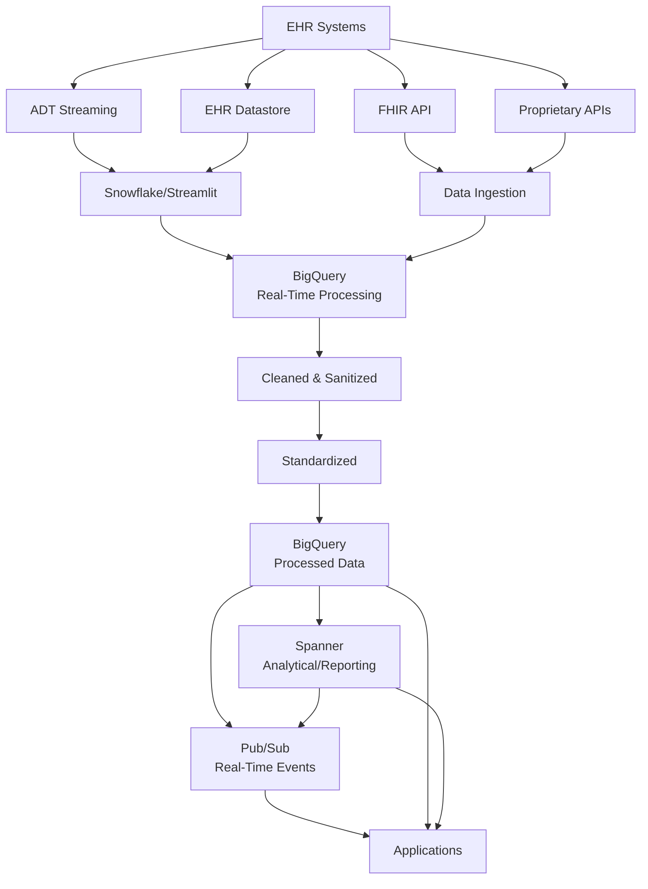

# Healthcare Data Access Patterns

This document describes the data access patterns available for healthcare summarization architectures, including FHIR APIs, proprietary EHR APIs, real-time streaming, and data access methods.

## Overview

Healthcare summarization architectures require flexible data access patterns to integrate with various healthcare systems, EHR platforms, and data stores. This document outlines the comprehensive data access patterns supported by the architecture.

## Data Sources

### 1. FHIR API (HL7 FHIR)

**Description**: Standard healthcare data exchange API (HL7 Fast Healthcare Interoperability Resources)

**Use Cases**:
- Interoperable healthcare data access
- Standardized patient data retrieval
- Cross-system data exchange
- Compliance with healthcare standards

**Implementation**:
```python
# FHIR API integration example
import requests
from fhir.resources.patient import Patient

# Access patient data via FHIR API
fhir_base_url = "https://fhir.example.com/fhir"
patient_id = "12345"

# Retrieve patient resource
response = requests.get(f"{fhir_base_url}/Patient/{patient_id}")
patient = Patient.parse_obj(response.json())

# Use in RAG summarization
orchestrator = DocumentStoreOrchestrator()
summary = orchestrator.query_patterns(
    query=f"Summarize patient {patient_id} medical history",
    use_agent=True,
)
```

**Vendor Support**:
- Epic FHIR API
- Cerner FHIR API
- Allscripts FHIR API
- Custom FHIR servers

### 2. Proprietary EHR APIs

**Description**: Vendor-specific EHR APIs (Epic, Cerner, Allscripts, etc.)

**Use Cases**:
- Direct EHR system integration
- Vendor-specific features
- Legacy system integration
- Custom EHR workflows

**Implementation**:
```python
# Proprietary EHR API integration
from epic_client import EpicClient
from cerner_client import CernerClient

# Epic integration
epic_client = EpicClient(
    base_url="https://epic.example.com",
    client_id=os.getenv("EPIC_CLIENT_ID"),
    client_secret=os.getenv("EPIC_CLIENT_SECRET"),
)

# Retrieve patient data
patient_data = epic_client.get_patient_data(patient_id)

# Use in summarization
summary = orchestrator.query_patterns(
    query=f"Summarize patient data: {patient_data}",
)
```

**Vendor Support**:
- Epic MyChart API
- Cerner PowerChart API
- Allscripts API
- Athenahealth API
- Any proprietary EHR API

### 3. Real-Time ADT (Admission, Discharge, Transfer) Streaming

**Description**: Real-time streaming of ADT events from EHR systems

**Data Flow**:
```
EHR System → Snowflake/Streamlit → BigQuery → Real-Time Processing → Summarization
```

**Use Cases**:
- Real-time patient admission summaries
- Discharge summary generation
- Transfer event processing
- Live clinical data summarization

**Implementation**:
```python
# Real-time ADT streaming from EHR through Snowflake/Streamlit to BigQuery
from google.cloud import bigquery
from google.cloud import pubsub_v1
import json

# Stream ADT events from EHR
def process_adt_event(event_data):
    """Process real-time ADT event."""
    
    # Event arrives from EHR → Snowflake/Streamlit → BigQuery
    # Process in real-time
    orchestrator = DocumentStoreOrchestrator()
    
    if event_data['event_type'] == 'ADMISSION':
        summary = orchestrator.query_patterns(
            query=f"Generate admission summary for patient {event_data['patient_id']}",
            use_ollama_rag=True,  # Real-time processing
        )
    
    return summary

# Subscribe to Pub/Sub for real-time events
subscriber = pubsub_v1.SubscriberClient()
subscription_path = subscriber.subscription_path(project_id, subscription_id)

def callback(message):
    event_data = json.loads(message.data)
    summary = process_adt_event(event_data)
    message.ack()

subscriber.subscribe(subscription_path, callback=callback)
```

### 4. EHR Datastore Streaming

**Description**: Real-time streaming from EHR datastore through Snowflake/Streamlit to BigQuery

**Architecture**:
```
EHR Datastore → Snowflake/Streamlit → BigQuery → Processing → Summarization
```

**Use Cases**:
- Real-time clinical data processing
- Live patient monitoring summaries
- Continuous data ingestion
- Event-driven summarization

## Data Processing Pipeline

### Pipeline Architecture



### Processing Stages

1. **Ingestion**: Data from FHIR, proprietary APIs, or streaming
2. **Real-Time Processing**: BigQuery for real-time event processing
3. **Cleaning & Sanitization**: Data quality and HIPAA compliance
4. **Standardization**: Normalize data formats (FHIR, HL7, etc.)
5. **Storage**: 
   - BigQuery: Processed, queryable data
   - Spanner: Analytical and reporting data
6. **Distribution**: Pub/Sub for real-time events

## Data Access Patterns

### 1. Direct BigQuery Access

**Description**: Direct query access to BigQuery for summarization

**Use Cases**:
- Batch summarization
- Historical data analysis
- Complex queries
- Data exploration

**Implementation**:
```python
from google.cloud import bigquery

client = bigquery.Client()

# Query patient data from BigQuery
query = """
SELECT 
    patient_id,
    encounter_date,
    diagnosis,
    treatment_plan
FROM `healthcare.patient_encounters`
WHERE patient_id = @patient_id
ORDER BY encounter_date DESC
LIMIT 10
"""

job_config = bigquery.QueryJobConfig(
    query_parameters=[
        bigquery.ScalarQueryParameter("patient_id", "STRING", patient_id)
    ]
)

results = client.query(query, job_config=job_config)

# Use in RAG summarization
patient_data = "\n".join([str(row) for row in results])
summary = orchestrator.query_patterns(
    query=f"Summarize patient encounters: {patient_data}",
)
```

### 2. FHIR API Access

**Description**: Access healthcare data through FHIR API

**Implementation**:
```python
# FHIR API access for summarization
from fhir.resources import bundle
import requests

def get_patient_fhir_data(patient_id):
    """Retrieve patient data via FHIR API."""
    fhir_url = f"https://fhir.example.com/fhir/Patient/{patient_id}"
    response = requests.get(fhir_url, headers={"Authorization": f"Bearer {token}"})
    return response.json()

# Use FHIR data in summarization
patient_fhir = get_patient_fhir_data(patient_id)
summary = orchestrator.query_patterns(
    query=f"Summarize FHIR patient data: {patient_fhir}",
)
```

### 3. Proprietary API Access

**Description**: Direct access to vendor-specific EHR APIs

**Implementation**:
```python
# Proprietary EHR API access
def get_epic_patient_data(patient_id):
    """Retrieve patient data from Epic."""
    epic_client = EpicClient(...)
    return epic_client.get_patient_data(patient_id)

# Use in summarization
epic_data = get_epic_patient_data(patient_id)
summary = orchestrator.query_patterns(
    query=f"Summarize Epic patient data: {epic_data}",
)
```

### 4. Real-Time Events via Pub/Sub

**Description**: Real-time event streaming from BigQuery/Spanner through Pub/Sub

**Use Cases**:
- Real-time summarization triggers
- Event-driven architecture
- Live data processing
- Streaming summarization

**Implementation**:
```python
from google.cloud import pubsub_v1
import json

# Subscribe to real-time events
subscriber = pubsub_v1.SubscriberClient()
subscription_path = subscriber.subscription_path(project_id, subscription_id)

def process_realtime_event(message):
    """Process real-time event for summarization."""
    event_data = json.loads(message.data)
    
    # Trigger summarization based on event
    orchestrator = DocumentStoreOrchestrator()
    
    if event_data['event_type'] == 'NEW_ENCOUNTER':
        summary = orchestrator.query_patterns(
            query=f"Summarize new encounter: {event_data['encounter_data']}",
            use_ollama_rag=True,  # Real-time processing
        )
        # Publish summary back via Pub/Sub
        publish_summary(summary)
    
    message.ack()

subscriber.subscribe(subscription_path, callback=process_realtime_event)
```

### 5. Direct Query Using Connectors

**Description**: Direct database queries using connectors (BigQuery, Spanner)

**Use Cases**:
- Direct database access
- Custom queries
- Performance-critical access
- Complex analytical queries

**Implementation**:
```python
# BigQuery connector
from google.cloud import bigquery

client = bigquery.Client(project="healthcare-project")

# Direct query
query = "SELECT * FROM `healthcare.patients` WHERE patient_id = @id"
results = client.query(query, job_config=job_config)

# Spanner connector
from google.cloud import spanner

spanner_client = spanner.Client(project="healthcare-project")
instance = spanner_client.instance("healthcare-instance")
database = instance.database("healthcare-db")

# Direct Spanner query
with database.snapshot() as snapshot:
    results = snapshot.execute_sql(
        "SELECT * FROM patients WHERE patient_id = @patient_id",
        params={"patient_id": patient_id},
    )
```

### 6. Microservices on BigQuery

**Description**: Microservices architecture accessing BigQuery

**Use Cases**:
- Service-oriented architecture
- Modular healthcare applications
- Scalable data access
- API-based access patterns

**Implementation**:
```python
# Microservice accessing BigQuery
from flask import Flask, jsonify
from google.cloud import bigquery

app = Flask(__name__)
bq_client = bigquery.Client()

@app.route('/api/patient/<patient_id>/summary', methods=['GET'])
def get_patient_summary(patient_id):
    """Microservice endpoint for patient summarization."""
    
    # Query BigQuery
    query = f"SELECT * FROM patients WHERE patient_id = '{patient_id}'"
    results = bq_client.query(query)
    patient_data = list(results)[0]
    
    # Generate summary using RAG
    orchestrator = DocumentStoreOrchestrator()
    summary = orchestrator.query_patterns(
        query=f"Summarize patient: {patient_data}",
        use_agent=True,
    )
    
    return jsonify(summary)
```

### 7. GraphQL on BigQuery/Spanner

**Description**: GraphQL API layer on top of BigQuery or Spanner

**Use Cases**:
- Flexible data querying
- Client-specific data requirements
- API simplification
- Modern application architectures

**Implementation**:
```python
# GraphQL resolver for BigQuery/Spanner
import graphene
from google.cloud import bigquery

class Patient(graphene.ObjectType):
    patient_id = graphene.String()
    summary = graphene.String()

class Query(graphene.ObjectType):
    patient = graphene.Field(Patient, patient_id=graphene.String(required=True))
    
    def resolve_patient(self, info, patient_id):
        # Query BigQuery
        bq_client = bigquery.Client()
        query = f"SELECT * FROM patients WHERE patient_id = '{patient_id}'"
        results = bq_client.query(query)
        patient_data = list(results)[0]
        
        # Generate summary
        orchestrator = DocumentStoreOrchestrator()
        summary = orchestrator.query_patterns(
            query=f"Summarize: {patient_data}",
        )
        
        return Patient(
            patient_id=patient_id,
            summary=summary['results'][0]['content']
        )

schema = graphene.Schema(query=Query)
```

## Data Flow Patterns

### Pattern 1: Real-Time Streaming Pipeline

```
EHR → Snowflake/Streamlit → BigQuery (Real-Time) → 
Cleaned/Sanitized → Standardized → BigQuery (Processed) → 
Spanner (Analytical) → Pub/Sub → Applications
```

### Pattern 2: API-Based Access

```
Applications → FHIR API / Proprietary API → 
BigQuery / Spanner → RAG Summarization → Response
```

### Pattern 3: Event-Driven Architecture

```
EHR Events → Pub/Sub → BigQuery Processing → 
Pub/Sub Events → Applications → RAG Summarization
```

### Pattern 4: Direct Database Access

```
Applications → Connectors → BigQuery / Spanner → 
Direct Queries → RAG Summarization
```

## Integration with RAG Patterns

### Basic RAG with Healthcare Data

```python
# Basic RAG using BigQuery data
from document_store.orchestrator import DocumentStoreOrchestrator
from google.cloud import bigquery

# Query patient data from BigQuery
bq_client = bigquery.Client()
query = "SELECT * FROM patients WHERE patient_id = @id"
patient_data = bq_client.query(query).to_dataframe()

# Ingest into document store
orchestrator = DocumentStoreOrchestrator()
orchestrator.ingest_documents([patient_data.to_dict()])

# Query with RAG
summary = orchestrator.query_patterns(
    query="Summarize patient medical history",
    use_agent=True,  # Use Google ADK agent
)
```

### Streaming RAG with Real-Time Events

```python
# Streaming RAG with Pub/Sub events
from google.cloud import pubsub_v1
from document_store.orchestrator import DocumentStoreOrchestrator

orchestrator = DocumentStoreOrchestrator()

def process_streaming_event(message):
    """Process real-time healthcare event with streaming RAG."""
    event = json.loads(message.data)
    
    # Real-time summarization
    summary = orchestrator.query_patterns(
        query=f"Summarize event: {event}",
        use_ollama_rag=True,  # Real-time processing
    )
    
    # Stream summary back
    publish_summary(summary)
    message.ack()
```

### Advanced RAG with Multi-Source Data

```python
# Advanced RAG combining multiple data sources
def summarize_patient_multi_source(patient_id):
    """Summarize using multiple data sources."""
    
    # Get data from multiple sources
    fhir_data = get_fhir_data(patient_id)
    epic_data = get_epic_data(patient_id)
    bq_data = get_bigquery_data(patient_id)
    
    # Combine and summarize
    orchestrator = DocumentStoreOrchestrator()
    summary = orchestrator.query_patterns(
        query=f"Summarize patient from multiple sources: {patient_id}",
        use_agent=True,  # ADK agent handles multi-source
    )
    
    return summary
```

## HIPAA Compliance Considerations

### Data Access Security
- **Authentication**: OAuth 2.0, service accounts
- **Authorization**: Role-based access control (RBAC)
- **Encryption**: Data in transit and at rest
- **Audit Logging**: All data access logged

### Data Sanitization
- **PHI Removal**: Remove protected health information (PHI) where not needed
- **De-identification**: De-identify data for non-production use
- **Access Controls**: Limit access to authorized personnel only

### Compliance Patterns
- **BAA Requirements**: Business Associate Agreements with vendors
- **Data Residency**: Regional data storage requirements
- **Retention Policies**: Data retention and deletion policies

## Performance Considerations

### BigQuery Optimization
- **Partitioning**: Partition tables by date/patient for performance
- **Clustering**: Cluster by patient_id for faster queries
- **Caching**: Use query result caching
- **Streaming Inserts**: Use streaming inserts for real-time data

### Spanner Optimization
- **Indexing**: Proper indexes for analytical queries
- **Interleaving**: Interleave tables for related data
- **Read Replicas**: Use read replicas for analytical workloads

### Real-Time Processing
- **Pub/Sub**: Use Pub/Sub for event-driven processing
- **Streaming**: Process data in streams for low latency
- **Batching**: Batch processing for efficiency

## Vendor Support

All data access patterns support all vendors:

### Cloud Platforms
- **Google Cloud**: BigQuery, Spanner, Pub/Sub, Healthcare API
- **AWS**: HealthLake, Kinesis, S3, Bedrock
- **Azure**: Azure Health Data Services, Event Hubs, Cosmos DB

### EHR Systems
- **Epic**: MyChart API, FHIR API
- **Cerner**: PowerChart API, FHIR API
- **Allscripts**: Proprietary API, FHIR API
- **Athenahealth**: API, FHIR API

### Data Platforms
- **Snowflake**: Data warehousing and streaming
- **Streamlit**: Real-time data processing
- **Any FHIR-compliant system**

## References

- [HL7 FHIR Specification](https://www.hl7.org/fhir/)
- [Google Cloud Healthcare API](https://cloud.google.com/healthcare-api)
- [BigQuery Documentation](https://cloud.google.com/bigquery/docs)
- [Cloud Spanner Documentation](https://cloud.google.com/spanner/docs)
- [Pub/Sub Documentation](https://cloud.google.com/pubsub/docs)

## Version History

- **v1.0** (2025-11-08): Initial healthcare data access patterns documentation

