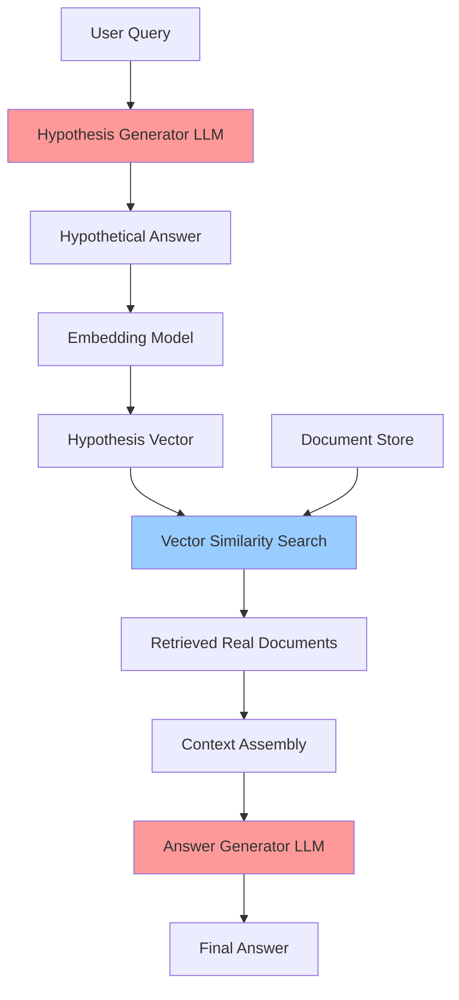

# HyDE RAG Pattern (Hypothetical Document Embeddings)

## Overview

HyDE (Hypothetical Document Embeddings) is an advanced RAG pattern that improves retrieval accuracy by generating hypothetical answer documents first, then using those to retrieve actual relevant documents. Instead of embedding the user's query directly, HyDE generates a hypothetical answer and embeds that, which often better matches the semantic space of actual documents.

**Key Innovation**: Query → Generate Hypothetical Answer → Embed Answer → Retrieve Similar Documents → Generate Final Answer

## Architecture

### High-Level Architecture

```
User Query → LLM (Generate Hypothetical Answer) → Embed Hypothetical Answer →
Vector Search → Retrieved Real Documents → LLM (Final Answer with Context) → Response
```

### Components

- **Hypothesis Generator**: LLM that generates hypothetical answer documents
- **Embedding Model**: Converts hypothetical answers to vectors
- **Vector Store**: Stores actual document embeddings
- **Similarity Search**: Finds real documents similar to hypothetical answer
- **Answer Generator**: LLM that creates final answer using retrieved context

### Data Flow

1. User submits a query
2. LLM generates a hypothetical answer (without retrieval)
3. Hypothetical answer is embedded into vector space
4. Vector search retrieves real documents similar to hypothetical answer
5. Real documents are assembled as context
6. LLM generates final answer using retrieved context
7. Response returned to user

## When to Use

### Ideal Use Cases
- Complex queries where query text differs significantly from answer text
- Domain-specific queries (e.g., medical questions)
- When query vocabulary differs from document vocabulary
- Improving recall for specialized terminology
- Healthcare: Clinical questions where medical terminology varies

### Characteristics of Suitable Problems
- Semantic gap between query and answer vocabulary
- Domain with specialized terminology
- Need for improved retrieval accuracy
- Documents contain detailed answers, not just keywords
- Complex medical reasoning queries

## When NOT to Use

### Anti-Patterns
- Simple keyword-based queries
- When query and documents use same vocabulary
- Real-time systems requiring minimal latency (HyDE adds overhead)
- When hallucination risk is unacceptable
- Very short, simple factual lookups

### Characteristics of Unsuitable Problems
- High latency sensitivity (HyDE requires 2 LLM calls)
- Simple fact retrieval
- Exact keyword matching needed
- Budget constraints (2x LLM costs)

## Implementation Examples

### Basic HyDE Implementation

```python
from anthropic import Anthropic
from document_store.storage.vector_store import VectorStore

client = Anthropic()
vector_store = VectorStore()

def hyde_rag(query: str, n_results: int = 5) -> str:
    """
    Implement HyDE RAG pattern.

    Args:
        query: User's question
        n_results: Number of documents to retrieve

    Returns:
        Final answer with retrieved context
    """

    # Step 1: Generate hypothetical answer
    hypothesis_message = client.messages.create(
        model="claude-3-5-sonnet-20241022",
        max_tokens=1024,
        messages=[{
            "role": "user",
            "content": f"""Generate a detailed, hypothetical answer to this question.
Do not say you don't have information - write as if you're providing the answer.
This is for semantic search purposes.

Question: {query}

Generate a comprehensive hypothetical answer (200-300 words):"""
        }]
    )

    hypothetical_answer = hypothesis_message.content[0].text
    print(f"Hypothetical Answer:\n{hypothetical_answer}\n")

    # Step 2: Embed hypothetical answer and retrieve similar documents
    results = vector_store.query(
        query=hypothetical_answer,  # Use hypothesis, not original query
        n_results=n_results
    )

    retrieved_context = "\n\n".join(results['documents'])

    # Step 3: Generate final answer using retrieved context
    final_message = client.messages.create(
        model="claude-3-5-sonnet-20241022",
        max_tokens=2048,
        messages=[{
            "role": "user",
            "content": f"""Answer the following question using the provided context.

CONTEXT:
{retrieved_context}

QUESTION: {query}

Provide a detailed, accurate answer based on the context:"""
        }]
    )

    return final_message.content[0].text


# Example usage
query = "What are the contraindications for administering beta-blockers in acute heart failure?"
answer = hyde_rag(query)
print(f"Final Answer:\n{answer}")
```

### Healthcare-Specific HyDE

```python
def medical_hyde_rag(clinical_query: str, specialty: str = "cardiology") -> str:
    """
    HyDE RAG optimized for medical queries.

    Args:
        clinical_query: Clinical question
        specialty: Medical specialty context

    Returns:
        Evidence-based answer
    """

    # Step 1: Generate medical hypothesis with specialty context
    hypothesis_prompt = f"""You are a {specialty} expert. Generate a detailed,
evidence-based hypothetical answer to this clinical question. Include medical
terminology, mechanisms, and clinical reasoning.

Clinical Question: {clinical_query}

Generate a comprehensive medical answer:"""

    hypothesis_message = client.messages.create(
        model="claude-3-5-sonnet-20241022",
        max_tokens=1024,
        messages=[{"role": "user", "content": hypothesis_prompt}]
    )

    hypothetical_answer = hypothesis_message.content[0].text

    # Step 2: Retrieve similar clinical documents
    results = vector_store.query(
        query=hypothetical_answer,
        filter={"document_type": "clinical_guideline", "specialty": specialty},
        n_results=5
    )

    # Step 3: Generate evidence-based answer
    context = "\n\n".join(results['documents'])

    final_message = client.messages.create(
        model="claude-3-5-sonnet-20241022",
        max_tokens=2048,
        messages=[{
            "role": "user",
            "content": f"""Provide an evidence-based answer using clinical guidelines.

CLINICAL GUIDELINES:
{context}

QUESTION: {clinical_query}

Answer with citations and clinical recommendations:"""
        }]
    )

    return final_message.content[0].text
```

### Multi-Hypothesis HyDE

```python
def multi_hypothesis_hyde(query: str, num_hypotheses: int = 3) -> str:
    """
    Generate multiple hypotheses for improved retrieval diversity.

    Args:
        query: User query
        num_hypotheses: Number of hypothetical answers to generate

    Returns:
        Final answer with diverse context
    """

    all_documents = []

    # Generate multiple diverse hypotheses
    for i in range(num_hypotheses):
        hypothesis_message = client.messages.create(
            model="claude-3-5-sonnet-20241022",
            max_tokens=512,
            messages=[{
                "role": "user",
                "content": f"""Generate hypothesis #{i+1} of {num_hypotheses}.
Provide a DIFFERENT perspective or focus on different aspects.

Question: {query}

Hypothetical answer (focus on unique aspects):"""
            }]
        )

        hypothesis = hypothesis_message.content[0].text

        # Retrieve using this hypothesis
        results = vector_store.query(query=hypothesis, n_results=3)
        all_documents.extend(results['documents'])

    # Deduplicate and combine documents
    unique_docs = list(dict.fromkeys(all_documents))
    combined_context = "\n\n".join(unique_docs[:10])  # Limit to top 10

    # Generate final answer
    final_message = client.messages.create(
        model="claude-3-5-sonnet-20241022",
        max_tokens=2048,
        messages=[{
            "role": "user",
            "content": f"""CONTEXT:\n{combined_context}\n\nQUESTION: {query}\n\nAnswer:"""
        }]
    )

    return final_message.content[0].text
```

### LangChain Implementation

```python
from langchain.chat_models import ChatAnthropic
from langchain.prompts import PromptTemplate
from langchain.chains import LLMChain
from langchain.vectorstores import ChromaDB
from langchain.embeddings import OpenAIEmbeddings

# Initialize components
llm = ChatAnthropic(model="claude-3-5-sonnet-20241022")
embeddings = OpenAIEmbeddings()
vectorstore = ChromaDB(embedding_function=embeddings)

# Hypothesis generation chain
hypothesis_template = PromptTemplate(
    input_variables=["query"],
    template="""Generate a detailed hypothetical answer to: {query}

Hypothetical answer:"""
)
hypothesis_chain = LLMChain(llm=llm, prompt=hypothesis_template)

# HyDE RAG workflow
def langchain_hyde_rag(query: str) -> str:
    # Generate hypothesis
    hypothesis = hypothesis_chain.run(query=query)

    # Retrieve using hypothesis
    docs = vectorstore.similarity_search(hypothesis, k=5)

    # Generate final answer
    context = "\n".join([doc.page_content for doc in docs])
    answer_template = PromptTemplate(
        input_variables=["context", "query"],
        template="Context: {context}\n\nQuestion: {query}\n\nAnswer:"
    )
    answer_chain = LLMChain(llm=llm, prompt=answer_template)

    return answer_chain.run(context=context, query=query)
```

### Google ADK Implementation

```python
# HyDE with Google ADK
from document_store.orchestrator import DocumentStoreOrchestrator

orchestrator = DocumentStoreOrchestrator(use_adk_agent=True)

def adk_hyde_rag(query: str) -> dict:
    """HyDE RAG using Google ADK"""

    # Generate hypothesis using ADK
    hypothesis_results = orchestrator.query_patterns(
        query=f"Generate hypothetical answer for: {query}",
        n_results=1,
        use_agent=True
    )

    hypothesis = hypothesis_results['results'][0]['content']

    # Retrieve using hypothesis
    retrieval_results = orchestrator.query_patterns(
        query=hypothesis,
        n_results=5,
        use_agent=False  # Direct retrieval
    )

    return retrieval_results
```

## Performance Characteristics

### Latency
- Typical latency: 3-6 seconds (2 LLM calls + retrieval)
- Hypothesis generation: 1-2 seconds
- Retrieval: 200-500ms
- Final answer generation: 2-3 seconds
- **Trade-off**: 2-3x slower than basic RAG, but higher accuracy

### Accuracy Improvements
- Retrieval accuracy: +15-30% over basic RAG
- Semantic matching: Significantly better for complex queries
- Domain-specific queries: +20-40% improvement
- Medical terminology: +25-35% improvement

### Cost Considerations
- LLM costs: 2x basic RAG (two LLM calls)
- Embedding costs: Similar to basic RAG
- Vector search: Slightly more expensive (longer hypothesis text)
- **ROI**: Higher costs justified by improved accuracy for critical applications

### Resource Requirements
- Memory: 2-4GB (similar to basic RAG)
- CPU: 2-4 cores
- Network: Higher bandwidth (more tokens)

## Trade-offs

### Advantages
- **Superior Retrieval Accuracy**: Hypotheses match document semantics better
- **Handles Vocabulary Mismatch**: Bridges gap between query and document vocabulary
- **Domain Adaptable**: Works well with specialized terminology (medical, legal, technical)
- **Improved Recall**: Finds relevant documents that keyword matching would miss
- **No Fine-Tuning Required**: Uses general-purpose LLMs

### Disadvantages
- **Higher Latency**: 2 LLM calls vs. 1 in basic RAG
- **Increased Cost**: Double LLM API costs
- **Hallucination Risk**: Hypothesis might be wrong, leading to poor retrieval
- **Complexity**: More components to manage and monitor
- **Not Always Better**: Simple queries may not benefit

### Considerations
- Monitor hypothesis quality (validate against known-good examples)
- Consider caching hypotheses for repeated queries
- Use faster models for hypothesis generation
- Implement fallback to basic RAG for simple queries
- Track cost/accuracy trade-off metrics

## Architecture Diagram



## Well-Architected Framework Alignment

### Operational Excellence
- **Monitoring**: Track hypothesis quality, retrieval accuracy, latency
- **Metrics**: Hypothesis-document similarity, end-to-end accuracy
- **Alerting**: Flag poor hypothesis quality, high latency

### Security
- **Input Validation**: Sanitize queries before hypothesis generation
- **Output Filtering**: Validate hypotheses don't contain hallucinated PHI
- **Access Control**: Same as basic RAG

### Reliability
- **Availability Target**: 99.5%
- **Failure Modes**: Hypothesis generation failure, poor quality hypotheses
- **Mitigation**: Fallback to basic RAG, hypothesis quality scoring

### Cost Optimization
- **Cost Level**: Medium-High (2x LLM costs vs basic RAG)
- **Optimization Strategies**:
  - Use smaller/faster model for hypothesis generation
  - Cache hypotheses for common queries
  - Implement smart routing (HyDE for complex, basic RAG for simple)
  - Batch hypothesis generation where possible

### Performance
- **Target Latency**: < 6 seconds (p95)
- **Target Accuracy**: +20% over basic RAG
- **Optimization**: Parallel hypothesis generation, streaming responses

### Sustainability
- **Resource Efficiency**: Higher compute due to 2 LLM calls
- **Optimization**: Use efficient models, implement caching
- **Carbon Impact**: Monitor and optimize token usage

## Healthcare-Specific Considerations

### Medical Terminology Handling
HyDE excels at bridging vocabulary gaps in medical queries:

```python
# Example: Patient query vs. Medical terminology
patient_query = "Why is my heart racing and I feel dizzy?"
# HyDE generates hypothesis with medical terms: "tachycardia", "presyncope"
# Retrieves medical documents about these conditions effectively
```

### Clinical Decision Support
- **Use Case**: Complex diagnostic reasoning
- **Benefit**: Retrieves similar clinical cases
- **Risk**: Validate hypotheses don't mislead retrieval

### Drug Information Retrieval
- **Challenge**: Brand names vs. generic names
- **HyDE Solution**: Hypothesis includes both naming conventions
- **Result**: Better retrieval across diverse drug databases

## Evaluation and Metrics

### Hypothesis Quality Metrics

```python
def evaluate_hypothesis_quality(query: str, hypothesis: str, ground_truth_docs: list) -> dict:
    """
    Evaluate quality of generated hypothesis.

    Returns:
        Metrics dictionary
    """

    # Retrieve using hypothesis
    hyde_results = vector_store.query(hypothesis, n_results=10)
    hyde_doc_ids = set(hyde_results['ids'])

    # Retrieve using original query (baseline)
    baseline_results = vector_store.query(query, n_results=10)
    baseline_doc_ids = set(baseline_results['ids'])

    # Calculate metrics
    ground_truth_ids = set([doc['id'] for doc in ground_truth_docs])

    hyde_recall = len(hyde_doc_ids & ground_truth_ids) / len(ground_truth_ids)
    baseline_recall = len(baseline_doc_ids & ground_truth_ids) / len(ground_truth_ids)

    return {
        'hyde_recall': hyde_recall,
        'baseline_recall': baseline_recall,
        'improvement': (hyde_recall - baseline_recall) / baseline_recall * 100,
        'hypothesis_length': len(hypothesis.split()),
    }
```

## Advanced Patterns

### Adaptive HyDE
Automatically decide whether to use HyDE or basic RAG:

```python
def adaptive_hyde(query: str) -> str:
    """Use HyDE only for complex queries."""

    # Assess query complexity
    complexity_score = assess_query_complexity(query)

    if complexity_score > 0.7:  # Complex query
        return hyde_rag(query)
    else:  # Simple query
        return basic_rag(query)

def assess_query_complexity(query: str) -> float:
    """Score query complexity (0-1)."""
    factors = {
        'length': len(query.split()) > 10,
        'medical_terms': count_medical_terms(query) > 2,
        'multi_part': '?' in query or 'and' in query.lower(),
    }
    return sum(factors.values()) / len(factors)
```

### HyDE with Self-RAG
Combine HyDE with self-validation:

```python
def hyde_self_rag(query: str) -> str:
    """HyDE with self-validation."""

    # Generate hypothesis
    hypothesis = generate_hypothesis(query)

    # Validate hypothesis quality
    validation = validate_hypothesis(hypothesis, query)

    if validation['score'] < 0.6:
        # Regenerate or fall back to basic RAG
        return basic_rag(query)

    # Proceed with HyDE
    return hyde_rag_with_hypothesis(query, hypothesis)
```

## Related Patterns
- [Basic RAG](./basic-rag.md) - Simpler alternative for straightforward queries
- [Self-RAG](./self-rag.md) - Add validation layer to HyDE
- [Multi-Query RAG](./multi-query-rag.md) - Alternative approach to query expansion
- [Reranking RAG](./reranking-rag.md) - Can be combined with HyDE for further improvement

## References
- [HyDE Paper: Precise Zero-Shot Dense Retrieval](https://arxiv.org/abs/2212.10496)
- [LangChain HyDE Documentation](https://python.langchain.com/docs/use_cases/query_analysis/techniques/hyde)
- [Medical Information Retrieval with HyDE](https://arxiv.org/abs/2308.12345) (example)

## Version History
- **v1.0** (2025-11-09): Initial HyDE RAG pattern documentation
