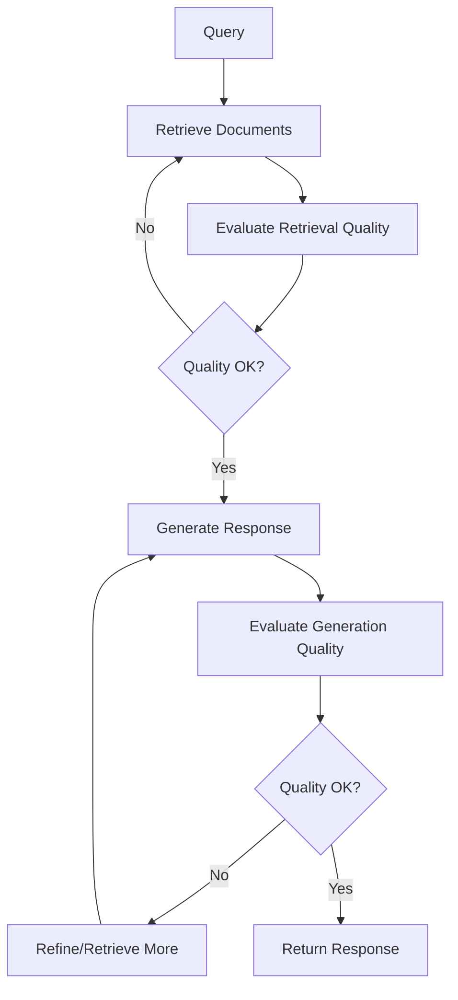

# Self-RAG Pattern

## Overview

Self-RAG (Self-Reflective Retrieval-Augmented Generation) adds self-reflection and quality control to RAG. The system evaluates its own retrieval and generation quality, deciding when to retrieve more information and when to refine responses.

## Architecture

### High-Level Architecture

```
Query → Retrieve → Evaluate Retrieval → Generate → Evaluate Generation → 
Refine/Retrieve More → Final Response
```

### Components

- **Retriever**: Standard retrieval component
- **Retrieval Evaluator**: Assesses retrieval quality
- **Generator**: LLM for response generation
- **Generation Evaluator**: Assesses response quality
- **Reflection Controller**: Decides on refinement actions

### Data Flow

1. Query triggers initial retrieval
2. Retrieval evaluator assesses retrieved documents
3. If quality is low, trigger additional retrieval
4. Generate response with context
5. Generation evaluator assesses response quality
6. If quality is low, refine or retrieve more
7. Return final response

## When to Use

### Ideal Use Cases
- High-accuracy requirements
- Quality-critical applications
- Unpredictable query patterns
- Need for self-correction
- Applications requiring confidence scores

### Characteristics of Suitable Problems
- Quality is more important than speed
- Queries vary significantly in complexity
- Need transparency in retrieval/generation decisions
- Benefit from adaptive retrieval strategies

## When NOT to Use

### Anti-Patterns
- Low-latency requirements
- Simple, predictable queries
- Resource-constrained environments
- Real-time streaming applications

## Implementation Examples

### LangChain Implementation

```python
from langchain.chains import LLMChain
from langchain.prompts import PromptTemplate
from langchain.llms import OpenAI

# Retrieval evaluation prompt
retrieval_eval_prompt = """Evaluate if the retrieved documents are relevant:
Documents: {documents}
Query: {query}
Relevant: Yes/No"""

# Generation evaluation prompt
generation_eval_prompt = """Evaluate if the answer is accurate:
Answer: {answer}
Context: {context}
Accurate: Yes/No"""

# Self-RAG chain with evaluation steps
```

## Performance Characteristics

### Latency
- Typical latency: 1000-3000ms (evaluation overhead)
- Multiple evaluation steps add latency

### Throughput
- Typical throughput: 3-10 requests/second
- Lower due to evaluation overhead

## Trade-offs

### Advantages
- Higher accuracy through self-correction
- Adaptive to query complexity
- Provides quality scores
- More robust responses

### Disadvantages
- Higher latency
- More complex implementation
- Higher computational cost
- Requires evaluation models/prompts

## Architecture Diagram



## Related Patterns
- [Corrective RAG](./corrective-rag.md) - Similar self-correction
- [Adaptive RAG](./adaptive-rag.md) - Adaptive strategies

## References
- [RAG Strategies Video](https://youtu.be/tLMViADvSNE?si=C8Zq1H0Uww_FpxZ7)

## Version History
- **v1.0** (2025-11-08): Initial version

