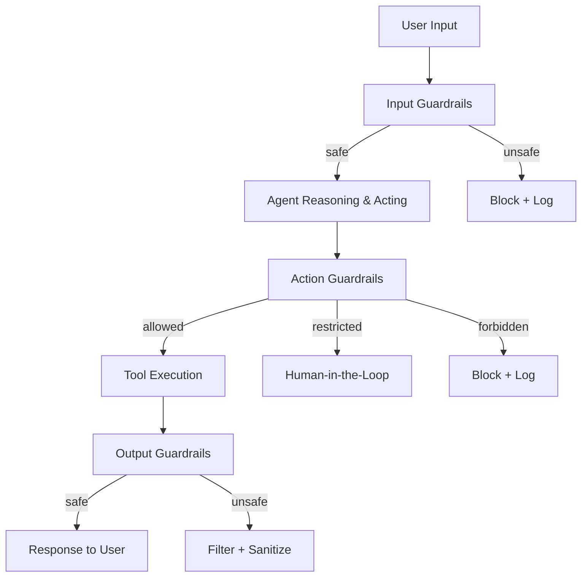

# Agent Guardrails & Safety Pattern

## Overview
Agent guardrails constrain what agents can do, preventing harmful actions, unauthorized data access, and unsafe outputs. For healthcare agents, guardrails are not optional — they're a **patient safety requirement**. This pattern covers input validation, output filtering, action constraints, human-in-the-loop controls, and content safety.

## Architecture



### Guardrail Layers

| Layer | What It Checks | When It Runs |
|-------|---------------|--------------|
| **Input Guardrails** | Prompt injection, jailbreaks, off-topic queries | Before agent processes query |
| **Action Guardrails** | Unauthorized tool calls, dangerous actions, scope violations | Before tool execution |
| **Output Guardrails** | PHI leakage, harmful medical advice, hallucination indicators | Before response delivery |
| **Rate Guardrails** | Token budgets, API call limits, cost caps | Continuously |

## Strategy Variations

### Input Validation
- **Prompt injection detection**: Detect attempts to override system prompts
- **Topic boundary enforcement**: Reject off-topic queries (e.g., non-medical questions to a clinical agent)
- **PII/PHI screening**: Detect and handle sensitive data in inputs

### Action Constraints
- **Tool allowlists**: Agent can only call pre-approved tools
- **Parameter validation**: Tool arguments must pass schema validation
- **Action severity levels**: Read-only actions auto-approved; write actions require confirmation
- **Cost caps**: Stop agent if total cost exceeds budget

### Output Safety
- **PHI detection and redaction**: Scan outputs for unintended PHI exposure
- **Medical safety checks**: Flag potentially dangerous medical advice
- **Hallucination indicators**: Confidence scoring, citation requirements
- **Content filtering**: Toxicity, bias, and harmful content detection

### Human-in-the-Loop (HITL)
- **Approval workflows**: Certain actions require human approval before execution
- **Escalation triggers**: Agent escalates to human when confidence is low
- **Review checkpoints**: Periodic human review of agent decisions
- **Override capability**: Human can override or correct agent actions at any point

## Implementation Examples

### Guardrails AI
```python
from guardrails import Guard
from guardrails.hub import DetectPII, ToxicLanguage

guard = Guard().use_many(
    DetectPII(pii_entities=["PERSON", "PHONE_NUMBER", "SSN"], on_fail="fix"),
    ToxicLanguage(threshold=0.8, on_fail="refrain"),
)

result = guard(
    llm_api=openai.chat.completions.create,
    prompt="Summarize this patient's condition...",
    model="gpt-4o",
)
```

### Custom Action Guardrails
```python
class ActionGuardrail:
    ALLOWED_TOOLS = {"get_lab_results", "search_guidelines", "check_interactions"}
    RESTRICTED_TOOLS = {"modify_medication", "place_order"}  # Require HITL
    FORBIDDEN_TOOLS = {"delete_record", "override_alert"}

    def check_action(self, tool_name: str, args: dict) -> str:
        if tool_name in self.FORBIDDEN_TOOLS:
            return "BLOCKED"
        if tool_name in self.RESTRICTED_TOOLS:
            return "REQUIRES_APPROVAL"
        if tool_name in self.ALLOWED_TOOLS:
            return "ALLOWED"
        return "BLOCKED"  # Default deny
```

### Google Model Armor
```python
# Google ADK with Model Armor for prompt injection screening
from google.adk import Agent

agent = Agent(
    model="gemini-2.0-flash",
    safety_settings={
        "model_armor": True,
        "input_screening": True,
        "output_filtering": True,
    },
)
```

## Healthcare Considerations

### Patient Safety Guardrails
- **Medication safety**: Flag contraindicated medications, dangerous dosages, drug interactions
- **Clinical scope**: Agent must not provide diagnoses outside its validated scope
- **Disclaimer requirements**: Clinical outputs must include appropriate disclaimers
- **Liability boundaries**: Clear boundaries on what agent can recommend vs. what requires physician review

### HIPAA Guardrails
- **Minimum necessary**: Agent only accesses PHI required for the current task
- **Audit logging**: Every PHI access is logged with user context and justification
- **De-identification**: Outputs sent to external systems must be de-identified
- **Access controls**: RBAC for which users can invoke which agent capabilities

## Related Patterns
- [Tool Use & Function Calling](./tool-use-pattern.md) — Guardrails constrain tool invocations
- [Agent Evaluation](./agent-evaluation-pattern.md) — Evaluating guardrail effectiveness
- [Adversarial Defense](../ai-design/security/adversarial-defense-pattern.md) — Defense against adversarial inputs
- [Privacy-Preserving ML](../ai-design/security/privacy-preserving-ml-pattern.md) — Privacy controls for agent data access

## References
- [Guardrails AI Documentation](https://www.guardrailsai.com/)
- [NVIDIA NeMo Guardrails](https://docs.nvidia.com/nemo/guardrails/)
- [Google Model Armor](https://cloud.google.com/security/products/model-armor)

## Version History
- **v1.0** (2026-02-05): Initial version
