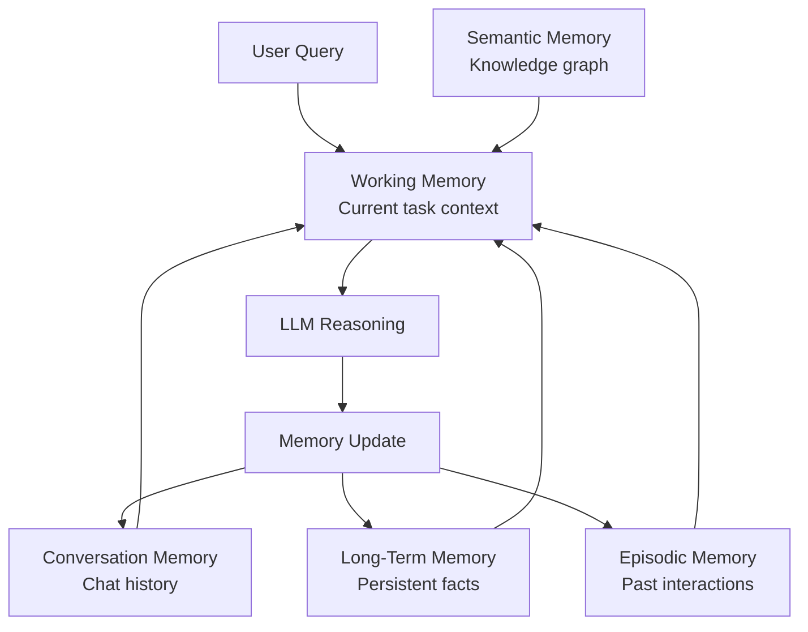

# Agent Memory Systems

## Overview
Agent memory systems manage how agents retain, retrieve, and use information across interactions. Without memory, agents start fresh every turn — they can't learn from previous interactions, maintain context across sessions, or build up knowledge over time. Memory is what transforms a stateless LLM into a persistent, context-aware agent.

## Memory Types

### Taxonomy

| Memory Type | Scope | Persistence | Purpose | Analogy |
|-------------|-------|-------------|---------|---------|
| **Working Memory** | Current task | Session | Active context for current reasoning | RAM |
| **Conversation Memory** | Current session | Session | Chat history within a conversation | Short-term memory |
| **Long-Term Memory** | Cross-session | Persistent | Facts, preferences, learned information | Hard drive |
| **Episodic Memory** | Cross-session | Persistent | Past interaction summaries with context | Diary |
| **Semantic Memory** | Cross-session | Persistent | Structured knowledge and relationships | Encyclopedia |

### Architecture



## Strategy Variations

### Conversation Memory Strategies

| Strategy | How It Works | Best For |
|----------|-------------|----------|
| **Full history** | Keep entire conversation in context | Short conversations (< 10 turns) |
| **Sliding window** | Keep last N messages | Long conversations, fixed context budget |
| **Summary memory** | LLM summarizes older messages | Very long conversations |
| **Token buffer** | Keep messages that fit in token budget | Precise context window management |

### Long-Term Memory Strategies

| Strategy | How It Works | Best For |
|----------|-------------|----------|
| **Vector store** | Embed and index memories for semantic retrieval | Fact-heavy agents, knowledge workers |
| **Key-value store** | Store named facts (user preferences, patient info) | Structured information |
| **Knowledge graph** | Store entities and relationships | Complex relationship reasoning |
| **Hybrid** | Combine vector + KV + graph | Production agents with diverse memory needs |

## Implementation Examples

### LangGraph with Persistent Memory
```python
from langgraph.checkpoint.sqlite import SqliteSaver
from langgraph.graph import StateGraph

# Persistent memory across sessions
memory = SqliteSaver.from_conn_string("agent_memory.db")

graph = StateGraph(AgentState)
# ... define graph nodes and edges ...
app = graph.compile(checkpointer=memory)

# Session 1
result = app.invoke(
    {"messages": [("user", "My name is Dr. Smith. I specialize in cardiology.")]},
    config={"configurable": {"thread_id": "session-001"}},
)

# Session 2 — agent remembers
result = app.invoke(
    {"messages": [("user", "What's my specialty?")]},
    config={"configurable": {"thread_id": "session-001"}},
)
# Agent responds: "Your specialty is cardiology, Dr. Smith."
```

### Mem0 (Dedicated Memory Layer)
```python
from mem0 import Memory

memory = Memory()

# Add memories
memory.add("Patient P-12345 is allergic to penicillin", user_id="dr-smith")
memory.add("Dr. Smith prefers SOAP format for notes", user_id="dr-smith")

# Retrieve relevant memories
results = memory.search("What allergies does P-12345 have?", user_id="dr-smith")
```

## Healthcare Considerations

### HIPAA Compliance
- Agent memories containing PHI must be encrypted at rest and in transit
- Memory persistence stores must be HIPAA-compliant
- Memory retention policies must align with data retention requirements
- Patient-specific memories must be deletable (right to be forgotten)

### Clinical Agent Memory
- **Patient context memory**: Allergies, medications, diagnoses persist across encounters
- **Physician preference memory**: Documentation style, preferred protocols
- **Institutional memory**: Hospital-specific guidelines, formulary, workflows

## Related Patterns
- [ReAct Pattern](./react-pattern.md) — Scratchpad is a form of working memory
- [Multi-Agent Systems](./multi-agent-pattern.md) — Shared memory between agents
- [Agent Guardrails](./agent-guardrails-pattern.md) — Memory access controls

## References
- [Mem0 Documentation](https://docs.mem0.ai/)
- [Zep Memory Framework](https://www.getzep.com/)
- [LangGraph Persistence](https://langchain-ai.github.io/langgraph/concepts/persistence/)

## Version History
- **v1.0** (2026-02-05): Initial version
