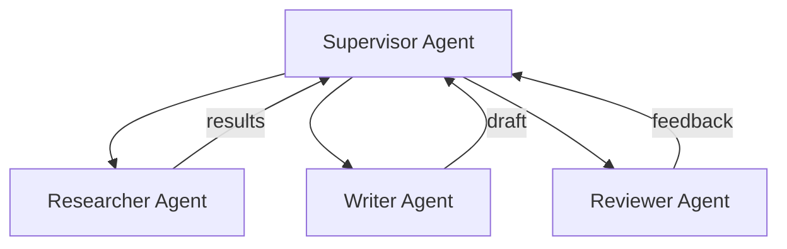
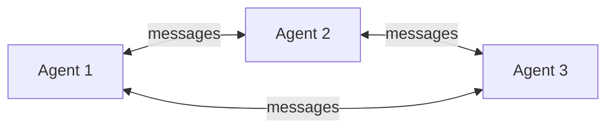
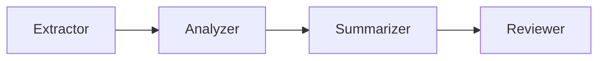

# Multi-Agent Systems Pattern

## Overview
Multi-agent systems use **multiple specialized agents** that collaborate to accomplish complex tasks. Instead of one monolithic agent handling everything, each agent has a focused role (researcher, writer, reviewer, coder) and they communicate through structured message passing. This mirrors how human teams work — specialists collaborating on complex problems.

## Architecture

### Topologies

#### Supervisor Pattern

A central supervisor routes tasks to specialized agents and synthesizes results.

#### Peer-to-Peer Pattern

Agents communicate directly with each other without a central coordinator.

#### Pipeline Pattern

Each agent processes output from the previous agent in a sequential chain.

### Components
- **Agent Registry**: Catalog of available agents with their capabilities
- **Message Router**: Directs messages between agents
- **Shared State**: Common workspace or blackboard for inter-agent data
- **Orchestrator**: Coordinates agent execution order and handles conflicts

## When to Use
- Tasks requiring multiple distinct skills (research + writing + review)
- Complex workflows with clear division of labor
- Quality-critical tasks where a reviewer agent checks another agent's work
- Tasks benefiting from debate or adversarial checking between agents

## When NOT to Use
- Simple tasks a single agent can handle
- Tasks where agent communication overhead exceeds the benefit
- Latency-critical applications (multi-agent adds significant overhead)

## Implementation Examples

### CrewAI Implementation
```python
from crewai import Agent, Task, Crew

researcher = Agent(
    role="Clinical Researcher",
    goal="Find relevant clinical evidence and guidelines",
    tools=[pubmed_search, guideline_lookup],
)

writer = Agent(
    role="Medical Writer",
    goal="Synthesize research into clear clinical summaries",
    tools=[],
)

reviewer = Agent(
    role="Clinical Reviewer",
    goal="Verify accuracy of medical content and flag errors",
    tools=[drug_interaction_checker, lab_reference_lookup],
)

research_task = Task(description="Research treatment options for Type 2 DM with CKD Stage 3", agent=researcher)
write_task = Task(description="Write a treatment summary based on research", agent=writer)
review_task = Task(description="Review the summary for clinical accuracy", agent=reviewer)

crew = Crew(agents=[researcher, writer, reviewer], tasks=[research_task, write_task, review_task])
result = crew.kickoff()
```

### Google ADK Multi-Agent
```python
from google.adk import Agent

researcher = Agent(name="researcher", model="gemini-2.0-flash", tools=[search_tool])
summarizer = Agent(name="summarizer", model="gemini-2.0-flash", tools=[])

orchestrator = Agent(
    name="orchestrator",
    model="gemini-2.0-flash",
    sub_agents=[researcher, summarizer],
    system_prompt="Coordinate research and summarization of clinical queries.",
)
```

## Healthcare Use Case: Clinical Case Review

```
Supervisor: "Review patient P-12345 for discharge readiness"
├── Data Agent: Pulls latest vitals, labs, medications from EHR
├── Clinical Agent: Assesses against discharge criteria
├── Medication Agent: Performs medication reconciliation
├── Social Agent: Checks follow-up appointments, transportation, support
└── Supervisor: Synthesizes into discharge readiness assessment
```

## Performance Characteristics
- Latency: 10-60 seconds (depends on number of agents and interactions)
- Cost: N × single agent cost (N agents, each making LLM calls)
- Quality: Generally higher than single agent for complex tasks

## Related Patterns
- [Plan-and-Execute](./plan-and-execute-pattern.md) — Planner + executor is a simple 2-agent system
- [Agent Orchestration Frameworks](./agent-frameworks-pattern.md) — Frameworks that support multi-agent
- [Agent Guardrails](./agent-guardrails-pattern.md) — Safety for multi-agent coordination

## References
- [CrewAI Documentation](https://docs.crewai.com/)
- [AutoGen: Enabling Next-Gen LLM Applications (Microsoft)](https://arxiv.org/abs/2308.08155)
- [LangGraph Multi-Agent](https://langchain-ai.github.io/langgraph/)

## Version History
- **v1.0** (2026-02-05): Initial version
