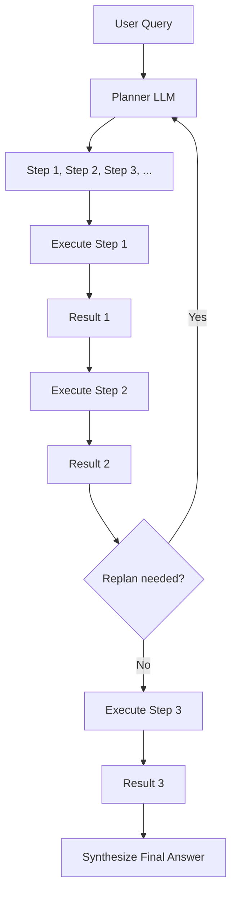

# Plan-and-Execute Pattern

## Overview
The Plan-and-Execute pattern separates **planning** (decomposing a complex task into steps) from **execution** (carrying out each step). A planner LLM creates an ordered plan, then an executor LLM (or agent) works through each step, optionally replanning when results deviate from expectations.

## Architecture



### Components
- **Planner**: LLM that decomposes the task into an ordered list of steps
- **Executor**: Separate LLM or agent that executes each step (may use tools, ReAct, etc.)
- **Replanner**: Monitors execution results and revises the plan if needed
- **State Manager**: Tracks which steps are complete, in progress, or blocked

## When to Use
- Complex multi-step tasks with clear decomposition (prior authorization workflows, care plan generation)
- Tasks where intermediate results affect subsequent steps
- When you need plan visibility and approval before execution
- Long-running tasks where progress tracking matters

## When NOT to Use
- Simple tasks that don't need decomposition
- Highly dynamic tasks where the plan changes every step (use ReAct instead)
- Time-critical tasks where planning overhead is unacceptable

## Implementation Examples

### LangGraph Implementation
```python
from langgraph.prebuilt import create_react_agent
from langgraph.graph import StateGraph, END

def plan_step(state):
    """Generate a plan from the user query."""
    plan = planner_llm.invoke(
        f"Break this task into steps: {state['query']}\n"
        f"Previous results: {state.get('results', [])}"
    )
    return {"plan": plan.steps, "current_step": 0}

def execute_step(state):
    """Execute the current step in the plan."""
    step = state["plan"][state["current_step"]]
    result = executor_agent.invoke(step)
    return {
        "results": state.get("results", []) + [result],
        "current_step": state["current_step"] + 1,
    }

def should_continue(state):
    if state["current_step"] >= len(state["plan"]):
        return "synthesize"
    return "execute"

graph = StateGraph()
graph.add_node("plan", plan_step)
graph.add_node("execute", execute_step)
graph.add_node("synthesize", synthesize_results)
graph.add_edge("plan", "execute")
graph.add_conditional_edges("execute", should_continue)
```

## Healthcare Use Case: Prior Authorization

```
Plan:
1. Retrieve patient demographics and insurance info
2. Look up the requested procedure/medication
3. Check insurance formulary / coverage rules
4. Gather supporting clinical evidence (diagnoses, labs, prior treatments)
5. Compile authorization request with required documentation
6. Submit to payer and track status
```

## Performance Characteristics
- Latency: 5-30 seconds (planning + execution of each step)
- Planning overhead: 1-3 seconds for plan generation
- Replanning: Adds 1-3 seconds per replan event

## Related Patterns
- [ReAct Pattern](./react-pattern.md) — Alternative: interleaved reasoning and acting
- [Multi-Agent Systems](./multi-agent-pattern.md) — Planner + executor can be separate agents
- [Tool Use](./tool-use-pattern.md) — Executor uses tools to carry out steps

## References
- [Plan-and-Solve Prompting (Wang et al., 2023)](https://arxiv.org/abs/2305.04091)
- [LangGraph Plan-and-Execute](https://langchain-ai.github.io/langgraph/)

## Version History
- **v1.0** (2026-02-05): Initial version
