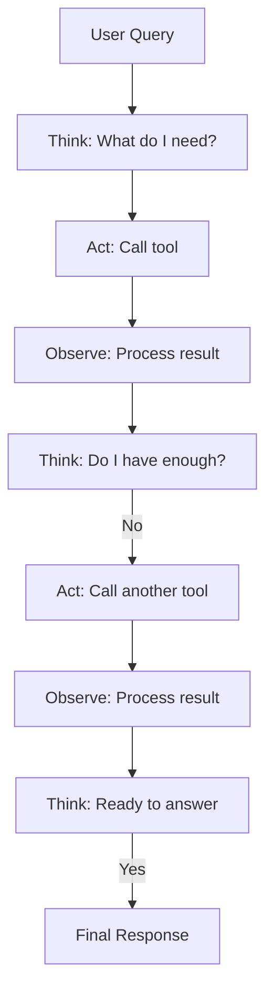

# ReAct Pattern (Reasoning + Acting)

## Overview
ReAct (Reasoning + Acting) is a foundational agent pattern where the LLM interleaves **thinking** (reasoning about what to do) with **acting** (executing tools) and **observing** (processing results). The loop continues until the agent has enough information to answer. This produces more reliable, explainable agent behavior compared to pure tool calling.

## Architecture

### The ReAct Loop
```
Think → Act → Observe → Think → Act → Observe → ... → Answer
```



### Components
- **Reasoning Engine**: LLM generates explicit thought traces about what to do next
- **Action Selector**: Chooses which tool to invoke based on reasoning
- **Observation Parser**: Processes tool results and feeds them back as observations
- **Termination Detector**: Decides when enough information has been gathered
- **Scratchpad**: Maintains the full think-act-observe history

## When to Use
- Multi-step information gathering (check vitals → check medications → check allergies → assess)
- Tasks requiring intermediate reasoning before acting
- When explainability matters — the thought trace shows the agent's reasoning
- Exploratory queries where the path isn't known upfront

## When NOT to Use
- Simple single-tool calls (use [Tool Use Pattern](./tool-use-pattern.md) directly)
- Tasks with a fixed, known sequence of steps (use [Plan-and-Execute](./plan-and-execute-pattern.md))
- Latency-critical applications (each think-act-observe cycle adds 1-3 seconds)

## Implementation Examples

### LangChain Implementation
```python
from langchain.agents import create_react_agent, AgentExecutor
from langchain_openai import ChatOpenAI
from langchain import hub

llm = ChatOpenAI(model="gpt-4o", temperature=0)
prompt = hub.pull("hwchase17/react")
tools = [get_patient_info, check_drug_interactions, get_guidelines]

agent = create_react_agent(llm, tools, prompt)
executor = AgentExecutor(
    agent=agent,
    tools=tools,
    verbose=True,  # Shows think-act-observe traces
    max_iterations=10,
    handle_parsing_errors=True,
)

result = executor.invoke({
    "input": "Patient P-12345 is on warfarin. Is it safe to start amiodarone?"
})
```

**Example trace:**
```
Thought: I need to check if there's an interaction between warfarin and amiodarone.
Action: check_drug_interactions
Action Input: {"drug_a": "warfarin", "drug_b": "amiodarone"}
Observation: SEVERE interaction. Amiodarone inhibits CYP2C9, increasing warfarin levels 30-50%.
Thought: This is a severe interaction. I should check the patient's current INR.
Action: get_patient_info
Action Input: {"patient_id": "P-12345", "info_type": "latest_INR"}
Observation: Latest INR: 2.8 (target 2.0-3.0), measured 2 days ago.
Thought: The patient's INR is already at the upper end. Adding amiodarone would dangerously increase it.
Final Answer: Starting amiodarone for patient P-12345 is HIGH RISK...
```

## Performance Characteristics
- Latency: 3-15 seconds (2-5 reasoning cycles typical)
- Cost: 2-5x a single LLM call (multiple turns)
- Accuracy: Higher than single-shot for complex tasks

## Healthcare Considerations
- Thought traces provide audit trails for clinical reasoning
- Each reasoning step is inspectable, supporting clinical trust
- HIPAA: All observations containing PHI must be logged and secured

## Related Patterns
- [Tool Use & Function Calling](./tool-use-pattern.md) — Foundation that ReAct builds on
- [Plan-and-Execute](./plan-and-execute-pattern.md) — Alternative: plan first, then execute
- [Agent Guardrails](./agent-guardrails-pattern.md) — Constrain reasoning and actions

## References
- [ReAct: Synergizing Reasoning and Acting in Language Models (Yao et al., 2023)](https://arxiv.org/abs/2210.03629)
- [LangChain ReAct Agent](https://python.langchain.com/docs/how_to/agent_executor/)

## Version History
- **v1.0** (2026-02-05): Initial version
