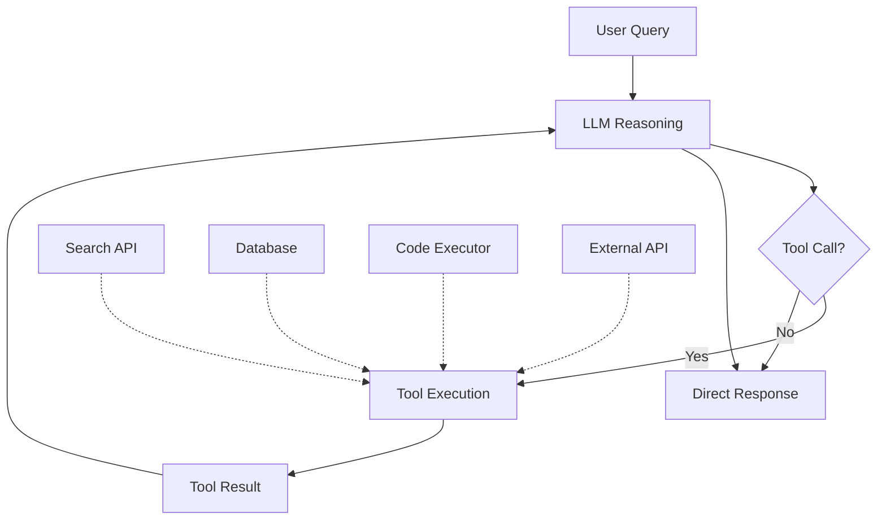

# Tool Use & Function Calling Pattern

## Overview
Tool use (also called function calling) enables LLMs to interact with the outside world by invoking structured API calls. Instead of generating only text, the model outputs a structured tool call (function name + arguments), the system executes the tool, and the result is fed back to the model. This is the **foundational capability** that makes agents possible.

## Architecture

### High-Level Architecture


### Components
- **Tool Registry**: Catalog of available tools with schemas (name, description, parameters, return type)
- **LLM Planner**: Decides when and which tool to call based on the query
- **Argument Extractor**: Parses structured arguments from the LLM output
- **Tool Executor**: Invokes the actual tool/API with validated arguments
- **Result Formatter**: Converts tool output into context for the LLM's next step
- **Error Handler**: Manages tool failures, timeouts, retries

### Data Flow
1. User submits a query
2. LLM receives query + tool definitions (schemas)
3. LLM decides to call a tool and outputs structured call (JSON)
4. System validates and executes the tool call
5. Tool result is appended to conversation
6. LLM generates final response using the tool result

## When to Use

### Ideal Use Cases
- LLM needs real-time data (current patient vitals, lab results, drug databases)
- Tasks requiring external system interaction (EHR queries, scheduling, ordering)
- Code execution or computation that LLMs can't do reliably in-text
- Multi-step workflows requiring API orchestration

### When NOT to Use
- Simple Q&A where the answer is in the LLM's training data or provided context
- Tasks where tool latency would make the experience unacceptable
- Environments where external API access is restricted

## Implementation Examples

### Google ADK Implementation
```python
from google.adk import Agent, Tool

# Define tools
@Tool(description="Look up patient's latest lab results")
def get_lab_results(patient_id: str, lab_type: str) -> dict:
    """Retrieve lab results from EHR system."""
    return ehr_client.get_labs(patient_id, lab_type)

@Tool(description="Check drug-drug interactions")
def check_interactions(drug_a: str, drug_b: str) -> dict:
    """Check for interactions between two medications."""
    return drug_db.check_interaction(drug_a, drug_b)

# Create agent with tools
agent = Agent(
    model="gemini-2.0-flash",
    tools=[get_lab_results, check_interactions],
    system_prompt="You are a clinical decision support agent.",
)

response = agent.run("Check if metformin and lisinopril interact for patient P-12345")
```

### Anthropic (Claude) Implementation
```python
import anthropic

client = anthropic.Anthropic()

tools = [
    {
        "name": "get_lab_results",
        "description": "Look up patient's latest lab results from EHR",
        "input_schema": {
            "type": "object",
            "properties": {
                "patient_id": {"type": "string", "description": "Patient identifier"},
                "lab_type": {"type": "string", "description": "Type of lab (CBC, BMP, etc.)"},
            },
            "required": ["patient_id", "lab_type"],
        },
    }
]

response = client.messages.create(
    model="claude-sonnet-4-5-20250929",
    max_tokens=1024,
    tools=tools,
    messages=[{"role": "user", "content": "Get the latest CBC for patient P-12345"}],
)

# Handle tool use response
for block in response.content:
    if block.type == "tool_use":
        result = execute_tool(block.name, block.input)
        # Send result back to Claude for final response
```

### LangChain Implementation
```python
from langchain.agents import create_tool_calling_agent, AgentExecutor
from langchain.tools import tool
from langchain_openai import ChatOpenAI

@tool
def get_lab_results(patient_id: str, lab_type: str) -> str:
    """Look up patient's latest lab results from EHR."""
    return ehr_client.get_labs(patient_id, lab_type)

llm = ChatOpenAI(model="gpt-4o")
agent = create_tool_calling_agent(llm, tools=[get_lab_results], prompt=prompt)
executor = AgentExecutor(agent=agent, tools=[get_lab_results])
result = executor.invoke({"input": "Get latest CBC for P-12345"})
```

## Performance Characteristics

### Latency
- Tool call overhead: 50-200ms per call (LLM decision + execution)
- Total latency: Query LLM time + tool execution time + response LLM time
- Typical: 1-5 seconds for single-tool workflows

### Tool Design Best Practices
- Keep tool descriptions clear and unambiguous
- Limit to 10-20 tools per agent (LLM accuracy drops with too many)
- Use strong typing for parameters
- Return structured results the LLM can easily interpret

## Healthcare Considerations

### HIPAA Compliance
- Tool calls accessing PHI must be logged in audit trails
- Tool execution environments must be HIPAA-compliant
- Results containing PHI must be handled with same security controls as direct data access

### Clinical Tools
- EHR query tools (FHIR APIs for Patient, Observation, MedicationRequest)
- Drug interaction databases (DailyMed, RxNorm)
- Clinical guideline lookup (UpToDate, DynaMed)
- Lab reference range tools
- Medical calculator tools (eGFR, MELD, CHA₂DS₂-VASc)

## Related Patterns
- [ReAct Pattern](./react-pattern.md) — Uses tool calling within a reasoning loop
- [Plan-and-Execute Pattern](./plan-and-execute-pattern.md) — Uses tools to execute planned steps
- [Agent Guardrails](./agent-guardrails-pattern.md) — Constraining which tools agents can call
- [Agentic RAG](../rag/agentic-rag.md) — RAG as a tool within an agent

## References
- [Anthropic Tool Use Documentation](https://docs.anthropic.com/en/docs/build-with-claude/tool-use)
- [OpenAI Function Calling](https://platform.openai.com/docs/guides/function-calling)
- [Google ADK Tools](https://google.github.io/adk-docs/)

## Version History
- **v1.0** (2026-02-05): Initial version
