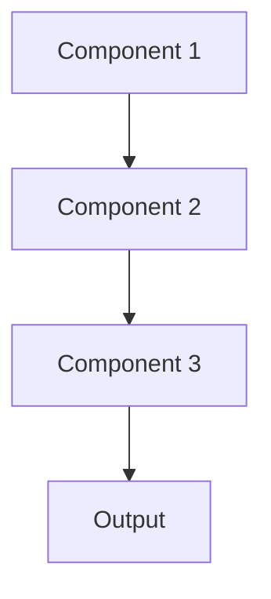

# Ab testing Pattern

## Overview

A/B Testing Pattern compares two model versions by routing traffic to each and measuring performance metrics, enabling data-driven decisions about model updates. For healthcare summarization, this might compare a new model's clinical accuracy or physician satisfaction against the current production model.

## When to Use

- **Model comparison**: Uncertain which of two models performs better in production
- **Risk mitigation**: Test new model on small traffic percentage before full rollout
- **Metric validation**: Real-world metrics differ from offline evaluation
- **User feedback**: Measure physician satisfaction or clinical workflow impact
- **Incremental rollout**: Gradually shift traffic to new model version

## When Not to Use

- **Clear winner**: Offline metrics already show dramatic improvement
- **Low traffic**: Insufficient volume for statistical significance
- **No metrics**: Can't measure what defines 'better' in production
- **Urgent deployment**: Critical fix needed immediately
- **Identical models**: Versions produce same results; no need to test

## Architecture



## Implementation Examples

### Vertex AI (Google Cloud) Implementation

```python
# Implementation example using Vertex AI
```

### LangChain Implementation

```python
# Implementation example using LangChain
```

### Anthropic (Claude) Implementation

```python
# Implementation example using Anthropic
```

### Ollama Implementation

```python
# Implementation example using Ollama
```

## Performance Characteristics

### Latency
- [Latency characteristics]

### Throughput
- [Throughput characteristics]

### Resource Usage
- [Resource usage characteristics]

## Trade-offs

### Advantages
- [Advantage 1]
- [Advantage 2]

### Disadvantages
- [Disadvantage 1]
- [Disadvantage 2]

## Use Cases

### Healthcare Summarization
- [Healthcare use case 1]
- [Healthcare use case 2]

### General Use Cases
- [General use case 1]
- [General use case 2]

## Well-Architected Framework Alignment

### Operational Excellence
- [Operational excellence considerations]

### Security
- [Security considerations]

### Reliability
- [Reliability considerations]

### Cost Optimization
- [Cost optimization considerations]

### Performance
- [Performance considerations]

### Sustainability
- [Sustainability considerations]

## Deployment Considerations

### Zonal Deployment
- [Zonal deployment considerations]

### Regional Deployment
- [Regional deployment considerations]

### Multi-Regional Deployment
- [Multi-regional deployment considerations]

### Hybrid Deployment
- [Hybrid deployment considerations]

## Related Patterns
- [Related Pattern 1](./related-pattern-1.md)
- [Related Pattern 2](./related-pattern-2.md)

## References
- [Reference 1]
- [Reference 2]

## Version History
- **v1.0** (YYYY-MM-DD): Initial version

