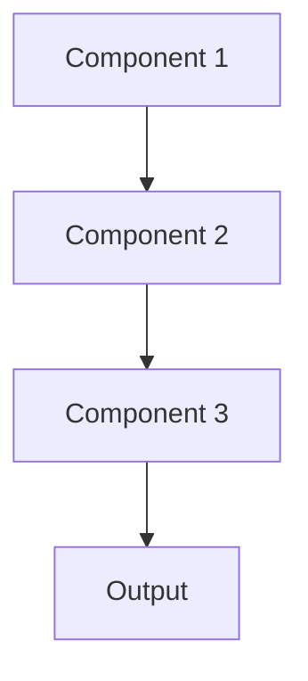

# Blue green deployment Pattern

## Overview

Blue-Green Deployment maintains two identical production environments (blue and green), allowing instant switching between them. Deploy new model to green environment, test thoroughly, then switch traffic from blue to green. If issues arise, instantly switch back to blue. Minimizes downtime and risk for healthcare AI systems.

## When to Use

- **Zero-downtime requirement**: Healthcare systems can't afford deployment downtime
- **Instant rollback**: Need ability to revert immediately if issues detected
- **Full testing**: Can test new version in production-like environment before switch
- **Database migrations**: Coordinate model and data schema changes
- **High availability**: Must maintain service during deployments

## When Not to Use

- **Resource constraints**: Can't afford duplicate production infrastructure
- **Stateful systems**: Blue/green environments can't easily share state
- **Gradual rollout needed**: Want to test on subset of users (use canary instead)
- **Frequent deployments**: Too expensive to maintain duplicate environments
- **Development phase**: Overkill for experimental systems

## Architecture



## Implementation Examples

### Vertex AI (Google Cloud) Implementation

```python
# Implementation example using Vertex AI
```

### LangChain Implementation

```python
# Implementation example using LangChain
```

### Anthropic (Claude) Implementation

```python
# Implementation example using Anthropic
```

### Ollama Implementation

```python
# Implementation example using Ollama
```

## Performance Characteristics

### Latency
- [Latency characteristics]

### Throughput
- [Throughput characteristics]

### Resource Usage
- [Resource usage characteristics]

## Trade-offs

### Advantages
- [Advantage 1]
- [Advantage 2]

### Disadvantages
- [Disadvantage 1]
- [Disadvantage 2]

## Use Cases

### Healthcare Summarization
- [Healthcare use case 1]
- [Healthcare use case 2]

### General Use Cases
- [General use case 1]
- [General use case 2]

## Well-Architected Framework Alignment

### Operational Excellence
- [Operational excellence considerations]

### Security
- [Security considerations]

### Reliability
- [Reliability considerations]

### Cost Optimization
- [Cost optimization considerations]

### Performance
- [Performance considerations]

### Sustainability
- [Sustainability considerations]

## Deployment Considerations

### Zonal Deployment
- [Zonal deployment considerations]

### Regional Deployment
- [Regional deployment considerations]

### Multi-Regional Deployment
- [Multi-regional deployment considerations]

### Hybrid Deployment
- [Hybrid deployment considerations]

## Related Patterns
- [Related Pattern 1](./related-pattern-1.md)
- [Related Pattern 2](./related-pattern-2.md)

## References
- [Reference 1]
- [Reference 2]

## Version History
- **v1.0** (YYYY-MM-DD): Initial version

