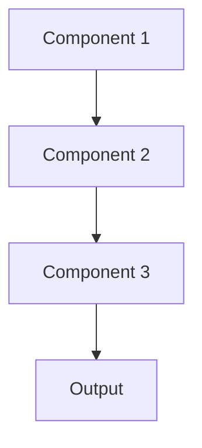

# Model serving Pattern

## Overview

Model Serving Pattern provides production infrastructure to host and serve ML models via APIs, handling request/response cycles, load balancing, and scaling. In healthcare, this enables clinical applications to query summarization models in real-time, supporting features like instant discharge summary generation or live clinical decision support.

## When to Use

- **Production deployment**: Models need to serve real user requests
- **API access**: Applications need programmatic access to model predictions
- **Multiple clients**: Many applications or users accessing the same model
- **Scalability**: Traffic varies and infrastructure must scale automatically
- **Version management**: Need to deploy and manage multiple model versions

## When Not to Use

- **Batch processing only**: All predictions can be pre-computed offline
- **Single user**: Only one researcher using model interactively
- **Embedded models**: Model runs on-device rather than via API
- **Development phase**: Still experimenting; production infrastructure premature
- **Static predictions**: Results don't change and can be cached indefinitely

## Architecture



## Implementation Examples

### Vertex AI (Google Cloud) Implementation

```python
# Implementation example using Vertex AI
```

### LangChain Implementation

```python
# Implementation example using LangChain
```

### Anthropic (Claude) Implementation

```python
# Implementation example using Anthropic
```

### Ollama Implementation

```python
# Implementation example using Ollama
```

## Performance Characteristics

### Latency
- [Latency characteristics]

### Throughput
- [Throughput characteristics]

### Resource Usage
- [Resource usage characteristics]

## Trade-offs

### Advantages
- [Advantage 1]
- [Advantage 2]

### Disadvantages
- [Disadvantage 1]
- [Disadvantage 2]

## Use Cases

### Healthcare Summarization
- [Healthcare use case 1]
- [Healthcare use case 2]

### General Use Cases
- [General use case 1]
- [General use case 2]

## Well-Architected Framework Alignment

### Operational Excellence
- [Operational excellence considerations]

### Security
- [Security considerations]

### Reliability
- [Reliability considerations]

### Cost Optimization
- [Cost optimization considerations]

### Performance
- [Performance considerations]

### Sustainability
- [Sustainability considerations]

## Deployment Considerations

### Zonal Deployment
- [Zonal deployment considerations]

### Regional Deployment
- [Regional deployment considerations]

### Multi-Regional Deployment
- [Multi-regional deployment considerations]

### Hybrid Deployment
- [Hybrid deployment considerations]

## Related Patterns
- [Related Pattern 1](./related-pattern-1.md)
- [Related Pattern 2](./related-pattern-2.md)

## References
- [Reference 1]
- [Reference 2]

## Version History
- **v1.0** (YYYY-MM-DD): Initial version

