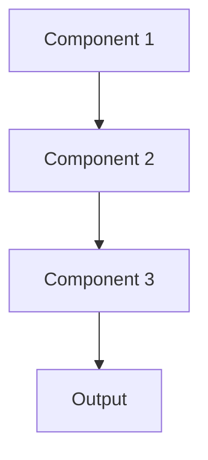

# Model interpretability Pattern

## Overview

Interpretable Models uses inherently transparent model architectures (linear models, decision trees, rule-based systems) where reasoning is directly understandable without post-hoc explanation techniques. For simpler healthcare tasks, this provides complete transparency into clinical decision logic.

## When to Use

- **Regulatory compliance**: Regulations require fully transparent models
- **Complete transparency**: Need to understand every aspect of model reasoning
- **Simple tasks**: Problem solvable with interpretable models without large accuracy loss
- **Clinical guidelines**: Encoding established medical guidelines as rules
- **Debugging**: Need to manually inspect and modify decision logic

## When Not to Use

- **Complex tasks**: Problem requires deep learning or complex models
- **Performance gap**: Interpretable models significantly less accurate
- **Unstructured data**: Text/images where deep learning excels
- **Modern LLMs**: Using foundation models that are inherently black-box
- **Explanation sufficient**: Post-hoc explainability adequate; full transparency not required

## Architecture



## Implementation Examples

### Vertex AI (Google Cloud) Implementation

```python
# Implementation example using Vertex AI
```

### LangChain Implementation

```python
# Implementation example using LangChain
```

### Anthropic (Claude) Implementation

```python
# Implementation example using Anthropic
```

### Ollama Implementation

```python
# Implementation example using Ollama
```

## Performance Characteristics

### Latency
- [Latency characteristics]

### Throughput
- [Throughput characteristics]

### Resource Usage
- [Resource usage characteristics]

## Trade-offs

### Advantages
- [Advantage 1]
- [Advantage 2]

### Disadvantages
- [Disadvantage 1]
- [Disadvantage 2]

## Use Cases

### Healthcare Summarization
- [Healthcare use case 1]
- [Healthcare use case 2]

### General Use Cases
- [General use case 1]
- [General use case 2]

## Well-Architected Framework Alignment

### Operational Excellence
- [Operational excellence considerations]

### Security
- [Security considerations]

### Reliability
- [Reliability considerations]

### Cost Optimization
- [Cost optimization considerations]

### Performance
- [Performance considerations]

### Sustainability
- [Sustainability considerations]

## Deployment Considerations

### Zonal Deployment
- [Zonal deployment considerations]

### Regional Deployment
- [Regional deployment considerations]

### Multi-Regional Deployment
- [Multi-regional deployment considerations]

### Hybrid Deployment
- [Hybrid deployment considerations]

## Related Patterns
- [Related Pattern 1](./related-pattern-1.md)
- [Related Pattern 2](./related-pattern-2.md)

## References
- [Reference 1]
- [Reference 2]

## Version History
- **v1.0** (YYYY-MM-DD): Initial version

