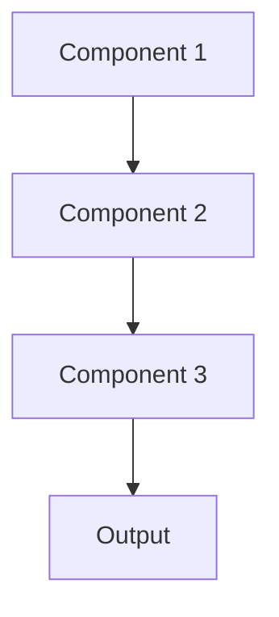

# Shap lime Pattern

## Overview

SHAP (SHapley Additive exPlanations) and LIME (Local Interpretable Model-agnostic Explanations) provide local explanations for individual predictions by approximating model behavior near specific inputs. For healthcare, this explains why a specific patient's summary included certain elements based on their particular clinical history.

## When to Use

- **Instance-level explanations**: Need to explain specific predictions to clinicians
- **Model-agnostic**: Works with any model type (black-box compatible)
- **Debugging specific cases**: Investigating why model failed on particular patient
- **Clinical review**: Helping physicians validate or challenge model outputs
- **Regulatory**: Explaining individual AI-assisted clinical decisions

## When Not to Use

- **Global understanding**: Need overall model behavior, not individual predictions
- **Real-time constraints**: SHAP/LIME too slow for production latency requirements
- **Simple models**: Inherently interpretable models don't need approximation
- **High-dimensional data**: Explanations become overwhelming with thousands of features
- **No local fidelity**: Model behavior too complex for local approximation

## Architecture



## Implementation Examples

### Vertex AI (Google Cloud) Implementation

```python
# Implementation example using Vertex AI
```

### LangChain Implementation

```python
# Implementation example using LangChain
```

### Anthropic (Claude) Implementation

```python
# Implementation example using Anthropic
```

### Ollama Implementation

```python
# Implementation example using Ollama
```

## Performance Characteristics

### Latency
- [Latency characteristics]

### Throughput
- [Throughput characteristics]

### Resource Usage
- [Resource usage characteristics]

## Trade-offs

### Advantages
- [Advantage 1]
- [Advantage 2]

### Disadvantages
- [Disadvantage 1]
- [Disadvantage 2]

## Use Cases

### Healthcare Summarization
- [Healthcare use case 1]
- [Healthcare use case 2]

### General Use Cases
- [General use case 1]
- [General use case 2]

## Well-Architected Framework Alignment

### Operational Excellence
- [Operational excellence considerations]

### Security
- [Security considerations]

### Reliability
- [Reliability considerations]

### Cost Optimization
- [Cost optimization considerations]

### Performance
- [Performance considerations]

### Sustainability
- [Sustainability considerations]

## Deployment Considerations

### Zonal Deployment
- [Zonal deployment considerations]

### Regional Deployment
- [Regional deployment considerations]

### Multi-Regional Deployment
- [Multi-regional deployment considerations]

### Hybrid Deployment
- [Hybrid deployment considerations]

## Related Patterns
- [Related Pattern 1](./related-pattern-1.md)
- [Related Pattern 2](./related-pattern-2.md)

## References
- [Reference 1]
- [Reference 2]

## Version History
- **v1.0** (YYYY-MM-DD): Initial version

