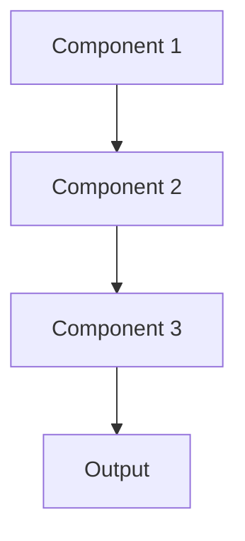

# Event driven Pattern

## Overview

Event-Driven Architecture uses asynchronous events to trigger actions and communicate between components, enabling loose coupling and reactive workflows. For healthcare AI, this processes new patient admissions, lab results, or clinical notes as events trigger summarization pipelines, updating dashboards in real-time.

## When to Use

- **Reactive workflows**: Actions triggered by events (new patient data, lab results)
- **Loose coupling**: Components communicate without direct dependencies
- **Asynchronous processing**: Operations don't need immediate responses
- **Real-time updates**: Pushing updates to dashboards as events occur
- **Scalability**: Event-driven systems scale well with load

## When Not to Use

- **Synchronous requirements**: Need immediate responses; can't wait for async events
- **Simple workflows**: Direct function calls simpler than event infrastructure
- **Debugging difficulty**: Event-driven systems harder to debug and test
- **Ordering requirements**: Complex event ordering hard to guarantee
- **Small scale**: Event infrastructure overhead not justified

## Architecture



## Implementation Examples

### Vertex AI (Google Cloud) Implementation

```python
# Implementation example using Vertex AI
```

### LangChain Implementation

```python
# Implementation example using LangChain
```

### Anthropic (Claude) Implementation

```python
# Implementation example using Anthropic
```

### Ollama Implementation

```python
# Implementation example using Ollama
```

## Performance Characteristics

### Latency
- [Latency characteristics]

### Throughput
- [Throughput characteristics]

### Resource Usage
- [Resource usage characteristics]

## Trade-offs

### Advantages
- [Advantage 1]
- [Advantage 2]

### Disadvantages
- [Disadvantage 1]
- [Disadvantage 2]

## Use Cases

### Healthcare Summarization
- [Healthcare use case 1]
- [Healthcare use case 2]

### General Use Cases
- [General use case 1]
- [General use case 2]

## Well-Architected Framework Alignment

### Operational Excellence
- [Operational excellence considerations]

### Security
- [Security considerations]

### Reliability
- [Reliability considerations]

### Cost Optimization
- [Cost optimization considerations]

### Performance
- [Performance considerations]

### Sustainability
- [Sustainability considerations]

## Deployment Considerations

### Zonal Deployment
- [Zonal deployment considerations]

### Regional Deployment
- [Regional deployment considerations]

### Multi-Regional Deployment
- [Multi-regional deployment considerations]

### Hybrid Deployment
- [Hybrid deployment considerations]

## Related Patterns
- [Related Pattern 1](./related-pattern-1.md)
- [Related Pattern 2](./related-pattern-2.md)

## References
- [Reference 1]
- [Reference 2]

## Version History
- **v1.0** (YYYY-MM-DD): Initial version

