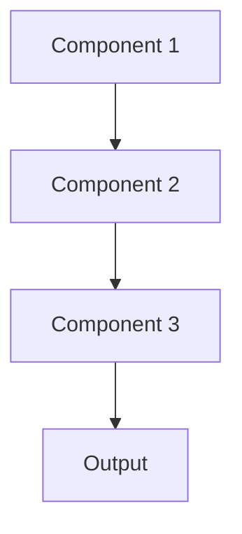

# Microservices Pattern

## Overview

Microservices decomposes applications into small, independent services that communicate via APIs, enabling teams to develop, deploy, and scale components independently. For healthcare AI, this separates document processing, embedding, retrieval, summarization, and storage as independent services.

## When to Use

- **Large teams**: Multiple teams working on different components
- **Independent scaling**: Different components have different scaling needs
- **Technology diversity**: Different services use different tech stacks or models
- **Independent deployment**: Deploy updates to components without affecting others
- **Complex domain**: Large application benefits from decomposition

## When Not to Use

- **Small application**: Monolith simpler for small systems
- **Tight coupling**: Components deeply interdependent; hard to separate
- **Small team**: Overhead of managing multiple services not justified
- **Distributed complexity**: Network latency and failure handling too complex
- **Transaction requirements**: Need ACID transactions across components

## Architecture



## Implementation Examples

### Vertex AI (Google Cloud) Implementation

```python
# Implementation example using Vertex AI
```

### LangChain Implementation

```python
# Implementation example using LangChain
```

### Anthropic (Claude) Implementation

```python
# Implementation example using Anthropic
```

### Ollama Implementation

```python
# Implementation example using Ollama
```

## Performance Characteristics

### Latency
- [Latency characteristics]

### Throughput
- [Throughput characteristics]

### Resource Usage
- [Resource usage characteristics]

## Trade-offs

### Advantages
- [Advantage 1]
- [Advantage 2]

### Disadvantages
- [Disadvantage 1]
- [Disadvantage 2]

## Use Cases

### Healthcare Summarization
- [Healthcare use case 1]
- [Healthcare use case 2]

### General Use Cases
- [General use case 1]
- [General use case 2]

## Well-Architected Framework Alignment

### Operational Excellence
- [Operational excellence considerations]

### Security
- [Security considerations]

### Reliability
- [Reliability considerations]

### Cost Optimization
- [Cost optimization considerations]

### Performance
- [Performance considerations]

### Sustainability
- [Sustainability considerations]

## Deployment Considerations

### Zonal Deployment
- [Zonal deployment considerations]

### Regional Deployment
- [Regional deployment considerations]

### Multi-Regional Deployment
- [Multi-regional deployment considerations]

### Hybrid Deployment
- [Hybrid deployment considerations]

## Related Patterns
- [Related Pattern 1](./related-pattern-1.md)
- [Related Pattern 2](./related-pattern-2.md)

## References
- [Reference 1]
- [Reference 2]

## Version History
- **v1.0** (YYYY-MM-DD): Initial version

