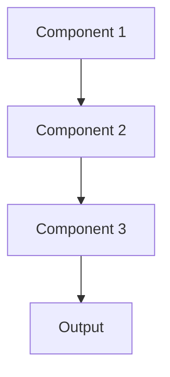

# Cicd for ml Pattern

## Overview

CI/CD for ML extends software continuous integration/deployment to machine learning, automating model training, testing, validation, and deployment pipelines. For healthcare AI, this enables safe, auditable, and reproducible model updates with automated checks for accuracy, bias, and compliance before production deployment.

## When to Use

- **Frequent model updates**: Regular retraining as new clinical data arrives
- **Reproducibility**: Need consistent, automated model building process
- **Quality gates**: Automated testing before deployment (accuracy, bias, safety checks)
- **Team collaboration**: Multiple data scientists working on models
- **Regulatory compliance**: Audit trails of model development and deployment

## When Not to Use

- **Research phase**: Exploratory work; automation premature
- **Infrequent updates**: Model updated once per year; manual process acceptable
- **Simple models**: Training takes seconds; automation overhead not justified
- **Single developer**: Solo data scientist; informal process works
- **No infrastructure**: Lack CI/CD platform or expertise to set up

## Architecture



## Implementation Examples

### Vertex AI (Google Cloud) Implementation

```python
# Implementation example using Vertex AI
```

### LangChain Implementation

```python
# Implementation example using LangChain
```

### Anthropic (Claude) Implementation

```python
# Implementation example using Anthropic
```

### Ollama Implementation

```python
# Implementation example using Ollama
```

## Performance Characteristics

### Latency
- [Latency characteristics]

### Throughput
- [Throughput characteristics]

### Resource Usage
- [Resource usage characteristics]

## Trade-offs

### Advantages
- [Advantage 1]
- [Advantage 2]

### Disadvantages
- [Disadvantage 1]
- [Disadvantage 2]

## Use Cases

### Healthcare Summarization
- [Healthcare use case 1]
- [Healthcare use case 2]

### General Use Cases
- [General use case 1]
- [General use case 2]

## Well-Architected Framework Alignment

### Operational Excellence
- [Operational excellence considerations]

### Security
- [Security considerations]

### Reliability
- [Reliability considerations]

### Cost Optimization
- [Cost optimization considerations]

### Performance
- [Performance considerations]

### Sustainability
- [Sustainability considerations]

## Deployment Considerations

### Zonal Deployment
- [Zonal deployment considerations]

### Regional Deployment
- [Regional deployment considerations]

### Multi-Regional Deployment
- [Multi-regional deployment considerations]

### Hybrid Deployment
- [Hybrid deployment considerations]

## Related Patterns
- [Related Pattern 1](./related-pattern-1.md)
- [Related Pattern 2](./related-pattern-2.md)

## References
- [Reference 1]
- [Reference 2]

## Version History
- **v1.0** (YYYY-MM-DD): Initial version

