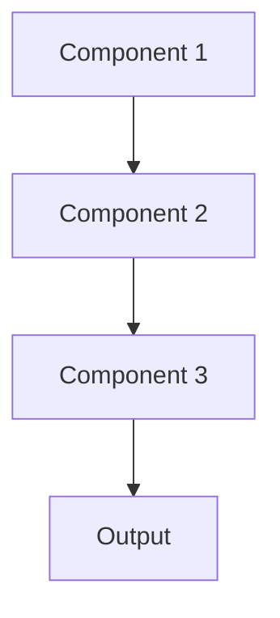

# Experiment tracking Pattern

## Overview

Experiment Tracking systematically records ML experiments with parameters, metrics, artifacts, and results, enabling reproducibility and comparison. For healthcare AI, this documents model development decisions, supports regulatory filings with evidence of systematic development, and helps teams understand what has been tried.

## When to Use

- **Many experiments**: Running dozens to hundreds of training experiments
- **Hyperparameter tuning**: Testing different model configurations
- **Team collaboration**: Sharing experiment results across team members
- **Reproducibility**: Need to reproduce exact experimental conditions
- **Decision documentation**: Regulatory filings require evidence of systematic development

## When Not to Use

- **Few experiments**: Running 1-5 experiments; manual tracking sufficient
- **Stable model**: Not experimenting; using established model
- **Solo researcher**: Informal notes work for single person
- **No comparison needed**: Each experiment independent; not comparing results
- **Simple models**: Fast experiments that don't justify tracking overhead

## Architecture



## Implementation Examples

### Vertex AI (Google Cloud) Implementation

```python
# Implementation example using Vertex AI
```

### LangChain Implementation

```python
# Implementation example using LangChain
```

### Anthropic (Claude) Implementation

```python
# Implementation example using Anthropic
```

### Ollama Implementation

```python
# Implementation example using Ollama
```

## Performance Characteristics

### Latency
- [Latency characteristics]

### Throughput
- [Throughput characteristics]

### Resource Usage
- [Resource usage characteristics]

## Trade-offs

### Advantages
- [Advantage 1]
- [Advantage 2]

### Disadvantages
- [Disadvantage 1]
- [Disadvantage 2]

## Use Cases

### Healthcare Summarization
- [Healthcare use case 1]
- [Healthcare use case 2]

### General Use Cases
- [General use case 1]
- [General use case 2]

## Well-Architected Framework Alignment

### Operational Excellence
- [Operational excellence considerations]

### Security
- [Security considerations]

### Reliability
- [Reliability considerations]

### Cost Optimization
- [Cost optimization considerations]

### Performance
- [Performance considerations]

### Sustainability
- [Sustainability considerations]

## Deployment Considerations

### Zonal Deployment
- [Zonal deployment considerations]

### Regional Deployment
- [Regional deployment considerations]

### Multi-Regional Deployment
- [Multi-regional deployment considerations]

### Hybrid Deployment
- [Hybrid deployment considerations]

## Related Patterns
- [Related Pattern 1](./related-pattern-1.md)
- [Related Pattern 2](./related-pattern-2.md)

## References
- [Reference 1]
- [Reference 2]

## Version History
- **v1.0** (YYYY-MM-DD): Initial version

