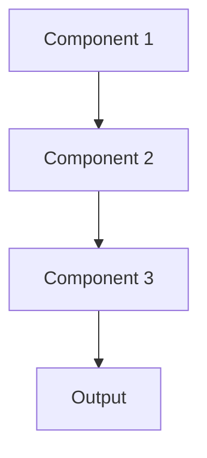

# Model governance Pattern

## Overview

Model Governance establishes policies, processes, and controls for managing ML models throughout their lifecycle, ensuring compliance, accountability, and risk management. For healthcare AI, this includes approval workflows, documentation requirements, access controls, and audit trails to meet FDA, HIPAA, and institutional requirements for medical AI systems.

## When to Use

- **Regulatory compliance**: Healthcare AI requires FDA clearance, HIPAA compliance, or institutional review
- **Enterprise deployment**: Large organizations need governance for model deployment and updates
- **High-risk applications**: Clinical decision support or patient-facing AI requires oversight
- **Multiple stakeholders**: Clinical, legal, IT, and data science teams need coordination
- **Audit requirements**: Must demonstrate model development, validation, and monitoring processes

## When Not to Use

- **Research phase**: Exploratory work where formal governance premature
- **Low-risk applications**: Non-clinical tools with minimal patient impact
- **Small team**: Solo developers where formal governance overhead not justified
- **Rapid prototyping**: Early development where governance slows iteration
- **No compliance needs**: No regulatory or institutional governance requirements

## Architecture



## Implementation Examples

### Vertex AI (Google Cloud) Implementation

```python
# Implementation example using Vertex AI
```

### LangChain Implementation

```python
# Implementation example using LangChain
```

### Anthropic (Claude) Implementation

```python
# Implementation example using Anthropic
```

### Ollama Implementation

```python
# Implementation example using Ollama
```

## Performance Characteristics

### Latency
- [Latency characteristics]

### Throughput
- [Throughput characteristics]

### Resource Usage
- [Resource usage characteristics]

## Trade-offs

### Advantages
- [Advantage 1]
- [Advantage 2]

### Disadvantages
- [Disadvantage 1]
- [Disadvantage 2]

## Use Cases

### Healthcare Summarization
- [Healthcare use case 1]
- [Healthcare use case 2]

### General Use Cases
- [General use case 1]
- [General use case 2]

## Well-Architected Framework Alignment

### Operational Excellence
- [Operational excellence considerations]

### Security
- [Security considerations]

### Reliability
- [Reliability considerations]

### Cost Optimization
- [Cost optimization considerations]

### Performance
- [Performance considerations]

### Sustainability
- [Sustainability considerations]

## Deployment Considerations

### Zonal Deployment
- [Zonal deployment considerations]

### Regional Deployment
- [Regional deployment considerations]

### Multi-Regional Deployment
- [Multi-regional deployment considerations]

### Hybrid Deployment
- [Hybrid deployment considerations]

## Related Patterns
- [Related Pattern 1](./related-pattern-1.md)
- [Related Pattern 2](./related-pattern-2.md)

## References
- [Reference 1]
- [Reference 2]

## Version History
- **v1.0** (YYYY-MM-DD): Initial version

