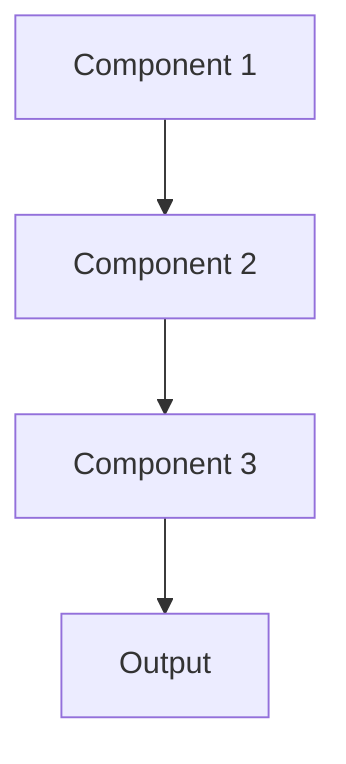

# Model monitoring Pattern

## Overview

Model Monitoring tracks production model performance, data quality, and system health in real-time, alerting when degradation occurs. For healthcare AI, this detects when summarization quality drops, input data distribution shifts, or system failures occur, enabling rapid response to protect patient care.

## When to Use

- **Production models**: Models serving real clinical workflows
- **Critical applications**: Model failures impact patient care or safety
- **Changing data**: Input distributions shift over time (new diseases, treatment protocols)
- **SLA requirements**: Must maintain accuracy and uptime guarantees
- **Compliance**: Regulatory requirements for ongoing model performance monitoring

## When Not to Use

- **Offline models**: Batch processing where delays are acceptable
- **Research phase**: Experimental models not in production
- **Static domain**: Input data and model behavior stable indefinitely
- **Manual review**: Humans review all outputs anyway; catch issues manually
- **Low stakes**: Model errors have minimal impact

## Architecture



## Implementation Examples

### Vertex AI (Google Cloud) Implementation

```python
# Implementation example using Vertex AI
```

### LangChain Implementation

```python
# Implementation example using LangChain
```

### Anthropic (Claude) Implementation

```python
# Implementation example using Anthropic
```

### Ollama Implementation

```python
# Implementation example using Ollama
```

## Performance Characteristics

### Latency
- [Latency characteristics]

### Throughput
- [Throughput characteristics]

### Resource Usage
- [Resource usage characteristics]

## Trade-offs

### Advantages
- [Advantage 1]
- [Advantage 2]

### Disadvantages
- [Disadvantage 1]
- [Disadvantage 2]

## Use Cases

### Healthcare Summarization
- [Healthcare use case 1]
- [Healthcare use case 2]

### General Use Cases
- [General use case 1]
- [General use case 2]

## Well-Architected Framework Alignment

### Operational Excellence
- [Operational excellence considerations]

### Security
- [Security considerations]

### Reliability
- [Reliability considerations]

### Cost Optimization
- [Cost optimization considerations]

### Performance
- [Performance considerations]

### Sustainability
- [Sustainability considerations]

## Deployment Considerations

### Zonal Deployment
- [Zonal deployment considerations]

### Regional Deployment
- [Regional deployment considerations]

### Multi-Regional Deployment
- [Multi-regional deployment considerations]

### Hybrid Deployment
- [Hybrid deployment considerations]

## Related Patterns
- [Related Pattern 1](./related-pattern-1.md)
- [Related Pattern 2](./related-pattern-2.md)

## References
- [Reference 1]
- [Reference 2]

## Version History
- **v1.0** (YYYY-MM-DD): Initial version

