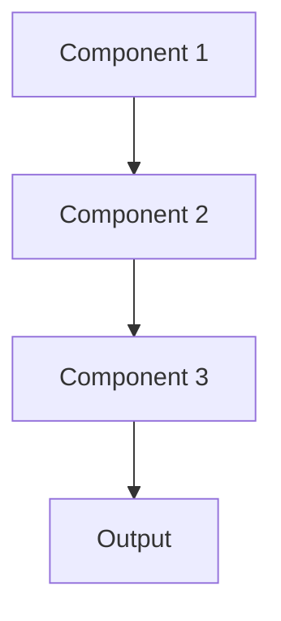

# Model retraining Pattern

## Overview

Automated Retraining systematically updates models with new data on a schedule or triggered by performance degradation, keeping models current as medical knowledge and clinical practices evolve. This ensures healthcare AI stays accurate as new treatments emerge and patient populations change.

## When to Use

- **Evolving domain**: Medical knowledge and practices change regularly
- **Continuous data**: New clinical data arrives that should improve model
- **Performance monitoring**: Can detect when retraining is needed
- **Reproducible pipeline**: Automated training pipeline already established
- **Regulatory approval**: Have process for validating and deploying retrained models

## When Not to Use

- **Stable domain**: Medical knowledge in this area doesn't change
- **Static dataset**: No new training data available
- **Manual validation**: Each model version requires extensive manual review
- **Resource constraints**: Retraining computationally expensive or slow
- **Rapid deployment risk**: Automated retraining could deploy problematic models

## Architecture



## Implementation Examples

### Vertex AI (Google Cloud) Implementation

```python
# Implementation example using Vertex AI
```

### LangChain Implementation

```python
# Implementation example using LangChain
```

### Anthropic (Claude) Implementation

```python
# Implementation example using Anthropic
```

### Ollama Implementation

```python
# Implementation example using Ollama
```

## Performance Characteristics

### Latency
- [Latency characteristics]

### Throughput
- [Throughput characteristics]

### Resource Usage
- [Resource usage characteristics]

## Trade-offs

### Advantages
- [Advantage 1]
- [Advantage 2]

### Disadvantages
- [Disadvantage 1]
- [Disadvantage 2]

## Use Cases

### Healthcare Summarization
- [Healthcare use case 1]
- [Healthcare use case 2]

### General Use Cases
- [General use case 1]
- [General use case 2]

## Well-Architected Framework Alignment

### Operational Excellence
- [Operational excellence considerations]

### Security
- [Security considerations]

### Reliability
- [Reliability considerations]

### Cost Optimization
- [Cost optimization considerations]

### Performance
- [Performance considerations]

### Sustainability
- [Sustainability considerations]

## Deployment Considerations

### Zonal Deployment
- [Zonal deployment considerations]

### Regional Deployment
- [Regional deployment considerations]

### Multi-Regional Deployment
- [Multi-regional deployment considerations]

### Hybrid Deployment
- [Hybrid deployment considerations]

## Related Patterns
- [Related Pattern 1](./related-pattern-1.md)
- [Related Pattern 2](./related-pattern-2.md)

## References
- [Reference 1]
- [Reference 2]

## Version History
- **v1.0** (YYYY-MM-DD): Initial version

